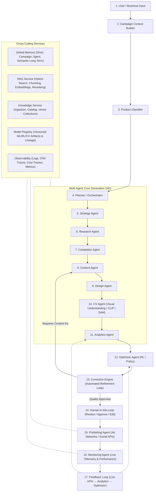
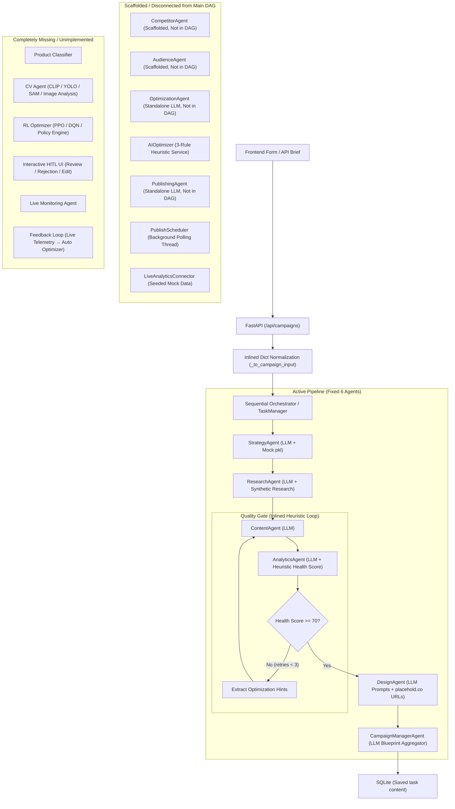
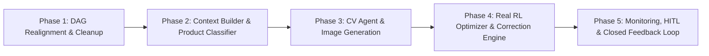

# ADPilot Pro — Master Pipeline Alignment Audit

> **Audit Date:** 2026-08-22  
> **Source of Truth:** ADPilot Master Pipeline (Officially Frozen)  
> **Repository:** `d:\ADP\ADPilot_Pro`  
> **Auditor:** Principal Software Architect / AI Systems Auditor  
> **Document Status:** FROZEN BASELINE ASSESSMENT

---

## Executive Overview

This document performs a complete forensic mapping of the **ADPilot Pro codebase** against the officially frozen **ADPilot Master Pipeline**:

```
User / Business Input
  → Campaign Context Builder
  → Product Classifier
  → Planner / Orchestrator
  → Strategy Agent
  → Research Agent
  → Competitor Agent
  → Content Agent
  → Design Agent
  → CV Agent
  → Analytics Agent
  → Optimizer Agent (RL)
  → Correction Engine
  → Human-in-the-Loop
  → Publishing Agent
  → Monitoring Agent
  → Feedback → Analytics → Optimizer
```

**Cross-Cutting Services:**
- Global Memory
- RAG
- Knowledge
- Model Registry
- Observability

---

## 1. Target Architecture vs. Current Architecture

### 1.1 Target Architecture (Master Pipeline Specification)



---

### 1.2 Current Architecture (What Actually Runs in Repository)



---

## 2. Comprehensive Component-by-Component Mapping

Below is the forensic audit of every component in the 17-stage Master Pipeline and all 5 Cross-Cutting Services.

| # | Target Pipeline Component | Exists? | File Location | Code Status | Current Input | Current Output | Calling Component | Consumer Component | Model Used | LLM Involved? | Custom ML/RL/CV? | Connected to Main DAG? |
|---|---|---|---|---|---|---|---|---|---|---|---|---|
| **1** | **User / Business Input** | **YES** | [`schemas/agent_schemas.py`](file:///d:/ADP/ADPilot_Pro/src/adpilot/schemas/agent_schemas.py), [`api/main.py`](file:///d:/ADP/ADPilot_Pro/src/adpilot/api/main.py), [`CampaignBriefForm.tsx`](file:///d:/ADP/ADPilot_Pro/frontend/src/components/CampaignBriefForm.tsx) | Production Code | Form input / HTTP JSON payload | `CampaignInput` Pydantic model | React UI / External Client via `POST /api/campaigns` | `TaskManager` / `Orchestrator` | None | No | No | **YES** |
| **2** | **Campaign Context Builder** | **PARTIAL** | Inlined in [`api/main.py`](file:///d:/ADP/ADPilot_Pro/src/adpilot/api/main.py#L225) and [`orchestrator.py`](file:///d:/ADP/ADPilot_Pro/src/adpilot/orchestration/orchestrator.py#L70) | Inlined Glue Code (No class) | `FrontendCampaignBrief` / `CampaignInput` | `CampaignContext` object | `submit_dashboard_campaign` / `TaskManager.run()` | `StrategyAgent` | None | No | No | **YES** (Inlined) |
| **3** | **Product Classifier** | **NO** | Missing in `src/adpilot/` (Referenced in `research/models/content/intent_classifier.pkl`) | Missing / Research Only | N/A | N/A | None | None | None | No | No | **NO** (Missing) |
| **4** | **Planner / Orchestrator** | **YES** | [`orchestration/orchestrator.py`](file:///d:/ADP/ADPilot_Pro/src/adpilot/orchestration/orchestrator.py), [`services/task_manager.py`](file:///d:/ADP/ADPilot_Pro/src/adpilot/services/task_manager.py) | Production Code (Duplicate files) | `OrchestratorInput` / `CampaignContext` | `OrchestratorOutput` | `api/main.py`, `worker.py` | Agents (Strategy $\to$ Research $\to$ Content $\to$ Analytics $\to$ Design $\to$ CampaignManager) | None (Deterministic Python DAG) | No | No | **YES** |
| **5** | **Strategy Agent** | **YES** | [`agents/strategy_agent.py`](file:///d:/ADP/ADPilot_Pro/src/adpilot/agents/strategy_agent.py) | Production Code | `StrategyAgentInput` (`campaign: CampaignInput`) | `StrategyAgentOutput` (Pillars, channel split, KPIs) | `Orchestrator.run()` / `TaskManager.run()` | `ResearchAgent`, `ContentAgent`, `AnalyticsAgent`, `DesignAgent` | OpenRouter / OpenAI / Anthropic + `strategy_model.pkl` | **YES** | Scikit-learn RandomForest (Mock, logged only) | **YES** |
| **6** | **Research Agent** | **YES** | [`agents/research_agent.py`](file:///d:/ADP/ADPilot_Pro/src/adpilot/agents/research_agent.py) | Production Code | `ResearchAgentInput` (`campaign: CampaignInput`) | `ResearchAgentOutput` (Personas, benchmarks, insights) | `Orchestrator.run()` / `TaskManager.run()` | `ContentAgent`, `AnalyticsAgent` | Configured LLM + `research_model.pkl` | **YES** | Scikit-learn RandomForest (Mock, logged only) | **YES** |
| **7** | **Competitor Agent** | **YES** | [`agents/competitor_agent.py`](file:///d:/ADP/ADPilot_Pro/src/adpilot/agents/competitor_agent.py) | Scaffold / Disconnected | `CompetitorAgentInput` (`campaign: CampaignInput`) | `CompetitorLandscape` (SWOT, market gaps) | Standalone test script only | None (Bypassed by main DAG; ResearchAgent creates inline competitors) | Configured LLM | **YES** | No | **NO** (Disconnected) |
| **8** | **Content Agent** | **YES** | [`agents/content_agent.py`](file:///d:/ADP/ADPilot_Pro/src/adpilot/agents/content_agent.py) | Production Code | `ContentAgentInput` (Strategy, Research, optimization hints) | `ContentAgentOutput` (Ads, emails, social posts) | `Orchestrator.run()` / `TaskManager.run()` | `AnalyticsAgent`, `DesignAgent`, `CampaignManagerAgent` | Configured LLM + `content_model.pkl` | **YES** | Scikit-learn model (Mock headline score) | **YES** |
| **9** | **Design Agent** | **YES** | [`agents/design_agent.py`](file:///d:/ADP/ADPilot_Pro/src/adpilot/agents/design_agent.py) | Production Code (Text-only) | `DesignAgentInput` (Strategy, Content, campaign_id) | `DesignAgentOutput` (Visual briefs, DALL-E prompts, placeholder URLs) | `Orchestrator.run()` / `TaskManager.run()` | `CampaignManagerAgent`, Frontend `ResultDisplay` | Configured LLM | **YES** | No (Generates `placehold.co` URLs) | **YES** |
| **10** | **CV Agent** | **NO** | Missing in `src/adpilot/agents/` (Scaffold in `services/image_service.py`) | Missing / Scaffolded Service | N/A | N/A | None | None | `models/cv_model.pkl` (Mock RandomForest) | No | No real CV (No CLIP, YOLO, SAM, OCR) | **NO** (Missing) |
| **11** | **Analytics Agent** | **YES** | [`agents/analytics_agent.py`](file:///d:/ADP/ADPilot_Pro/src/adpilot/agents/analytics_agent.py) | Production Code | `AnalyticsAgentInput` (Campaign, Strategy, Research, Content) | `AnalyticsAgentOutput` (Health score, metric forecasts, suggestions) | `Orchestrator.run()` / `TaskManager.run()` | Quality Gate check in `TaskManager`, `CampaignManagerAgent` | Configured LLM + `analytics_model.pkl` | **YES** | Scikit-learn RandomForest (Mock ROAS) | **YES** |
| **12** | **Optimizer Agent (RL)** | **PARTIAL** | [`agents/optimization_agent.py`](file:///d:/ADP/ADPilot_Pro/src/adpilot/agents/optimization_agent.py), [`services/ai_optimizer.py`](file:///d:/ADP/ADPilot_Pro/src/adpilot/services/ai_optimizer.py) | Scaffold / Heuristic Rule Engine (No RL) | `CampaignMetrics` + `CampaignTargets` / `OptimizationAgentInput` | `List[OptimizationRecommendation]` / `OptimizationOutput` | Standalone endpoint `POST /api/optimizer/evaluate` | API response only (Not fed back into DAG) | 3-Rule Heuristics (`AIOptimizer`) / LLM (`OptimizationAgent`) | YES (in agent) / NO (in service) | **NO RL** (No Gym env, policy network, or PPO/DQN) | **NO** (Disconnected) |
| **13** | **Correction Engine** | **PARTIAL** | Inlined in [`services/task_manager.py`](file:///d:/ADP/ADPilot_Pro/src/adpilot/services/task_manager.py#L80-L125) | Inlined Quality Gate Loop | `AnalyticsAgentOutput.health_score.overall` (< 70) | `optimization_hints: list[str]` injected into retry | `TaskManager.run()` | `ContentAgent.run()` (Retried up to 3 times) | None (Deterministic Python evaluation) | No | No | **YES** (Inlined) |
| **14** | **Human-in-the-Loop (HITL)** | **PARTIAL** | [`api/main.py`](file:///d:/ADP/ADPilot_Pro/src/adpilot/api/main.py#L1180), [`models/audit_log.py`](file:///d:/ADP/ADPilot_Pro/src/adpilot/models/audit_log.py) | Partial Backend RBAC Gate | `PublishRequest` + Bearer Token | `CampaignPublish` record (`status='scheduled'`) | API Client / Frontend | `PublishScheduler` | None | No | No | **PARTIAL** (Publishing only; no DAG review UI) |
| **15** | **Publishing Agent** | **PARTIAL** | [`agents/publishing_agent.py`](file:///d:/ADP/ADPilot_Pro/src/adpilot/agents/publishing_agent.py), [`services/scheduler.py`](file:///d:/ADP/ADPilot_Pro/src/adpilot/services/scheduler.py), [`services/integrations/`](file:///d:/ADP/ADPilot_Pro/src/adpilot/services/integrations/) | Scaffold / Mock Background Service | `PublishingAgentInput` / `CampaignPublish` SQL records | `PublishingPackage` / Dispatched mock API call | `PublishScheduler` thread / Standalone test | Mock Clients (`MetaAdsClient`, `GoogleAdsClient`, etc.) | Configured LLM (Agent) / None (Scheduler) | YES (Agent) | Mock stubs only (Deterministic fake publish IDs) | **NO** (Agent not in DAG; scheduler runs in background) |
| **16** | **Monitoring Agent** | **NO** | [`services/analytics/connectors.py`](file:///d:/ADP/ADPilot_Pro/src/adpilot/services/analytics/connectors.py), [`ml/monitoring/drift_detector.py`](file:///d:/ADP/ADPilot_Pro/ml/monitoring/drift_detector.py) | Missing / Mock Telemetry Generator | `platform: str`, `days: int` | Seeded synthetic metrics (Impressions, Clicks, Spend) | `GET /api/campaigns/{id}/analytics/live` | Frontend Dashboard (when enabled) | Deterministic Random Seed Generator | No | No (No real metric collection or anomaly detection) | **NO** (Disconnected) |
| **17** | **Feedback Loop** | **NO** | Missing | Not Implemented | N/A | N/A | None | None | None | No | No | **NO** (Open loop) |

---

### Cross-Cutting Services Mapping

| Cross-Cutting Service | Target Capability | Exists? | File Location | Code Status | Current Capabilities | Missing Capabilities |
|---|---|---|---|---|---|---|
| **Global Memory** | Centralized 4-tier context & state persistence | **YES** | [`memory/manager.py`](file:///d:/ADP/ADPilot_Pro/src/adpilot/memory/manager.py), [`services/memory_service.py`](file:///d:/ADP/ADPilot_Pro/src/adpilot/services/memory_service.py) | Production Code | ShortTermMemory (in-memory dict), CampaignMemory (MongoDB `campaigns`), AgentMemory (MongoDB `agent_runs`), LongTermMemory (MongoDB `memories` chronological query) | Semantic vector search across past campaigns in LongTermMemory (currently stubbed for Phase 6); multi-tenant isolation |
| **RAG** | Campaign knowledge base retrieval & grounding | **YES** | [`services/rag_service.py`](file:///d:/ADP/ADPilot_Pro/src/adpilot/services/rag_service.py), [`services/document_loader.py`](file:///d:/ADP/ADPilot_Pro/src/adpilot/services/document_loader.py), [`services/qdrant_store.py`](file:///d:/ADP/ADPilot_Pro/src/adpilot/services/qdrant_store.py) | Production Code | PDF/MD/TXT file loader, RecursiveCharacterTextSplitter (1000/200), Qdrant local/cloud vector store, Cosine similarity search (k=3), prompt injection in `BaseAgent` | Hybrid search (BM25), Cross-encoder reranking, Source citation tracking, Relevance thresholding |
| **Knowledge** | Structured knowledge catalog & document management | **YES** | [`services/knowledge_service.py`](file:///d:/ADP/ADPilot_Pro/src/adpilot/services/knowledge_service.py), `POST /api/knowledge/upload` | Production Code | Ingestion pipeline, multi-format parsing, chunking, and Qdrant collection namespace management per campaign | Knowledge graph integration, automatic deduplication, document metadata taxonomy |
| **Model Registry** | Versioned storage, tracking, and governance for ML/RL/CV models | **NO** | [`ml/utils/mlflow_helper.py`](file:///d:/ADP/ADPilot_Pro/ml/utils/mlflow_helper.py), [`ml/registry/`](file:///d:/ADP/ADPilot_Pro/ml/registry/), [`models/`](file:///d:/ADP/ADPilot_Pro/models/) | Scaffold / Local File System | Static `.pkl` file loading via `joblib`/`pickle`; local SQLite MLflow helper for synthetic notebooks | Model versioning, staging/prod model staging, lineage tracking, automated model cards, artifact verification |
| **Observability** | End-to-end tracing, metrics, cost analysis, and error tracking | **PARTIAL** | [`utils/logging_utils.py`](file:///d:/ADP/ADPilot_Pro/src/adpilot/utils/logging_utils.py), [`services/cost_tracker.py`](file:///d:/ADP/ADPilot_Pro/src/adpilot/services/cost_tracker.py) | Partial Production Code | `structlog` JSON structured logging, `CostTrackingCallbackHandler` logging token consumption and USD costs to MongoDB, `AgentRunRecord` telemetry | OpenTelemetry distributed tracing, Prometheus metrics endpoint, Sentry error monitoring, LangSmith/Langfuse trace visualization |

---

## 3. Discrepancy & Gap Analysis

### 3.1 Missing Components (Must Be Built)

1. **Product Classifier (Stage 3)**:
   - *Target:* Classifies incoming campaign brief into business category, vertical, B2B vs. B2C, product tier, and funnel type to route downstream prompt strategies.
   - *Current State:* Does not exist in production code. Only placeholder notebooks exist in research.
2. **Computer Vision (CV) Agent (Stage 10)**:
   - *Target:* Visual understanding, brand color palette extraction, image style scoring, aesthetic verification, and visual asset generation/validation using CLIP, SAM, or vision LLMs.
   - *Current State:* Does not exist. `DesignAgent` only writes text prompts with `placehold.co` URLs. `ImageService` (DALL-E 3) exists in isolation but is not wired up.
3. **Reinforcement Learning (RL) Optimizer (Stage 12)**:
   - *Target:* Policy-gradient / multi-armed bandit / PPO optimization engine that dynamically adjusts budget allocation, bids, and copy variants based on reward signals.
   - *Current State:* Zero RL implementation. The current `ai_optimizer.py` is a 77-line script with 3 static `if` statements.
4. **Interactive Human-in-the-Loop Workflow (Stage 14)**:
   - *Target:* A dedicated UI/API state machine allowing human operators to review intermediate outputs (strategy, copy, creatives), edit generated assets, reject components with feedback, or approve for distribution.
   - *Current State:* The pipeline executes end-to-end without pausing. The only human gate is the separate `POST /api/campaigns/{id}/publish` endpoint.
5. **Live Monitoring Agent (Stage 16)**:
   - *Target:* Real-time ingestion of live ad performance telemetry from Meta/Google/LinkedIn ad accounts, detecting metric anomalies and performance degradation.
   - *Current State:* `LiveAnalyticsConnector` merely computes synthetic numbers with `random.seed()`. No real monitoring agent exists.
6. **Closed Feedback Loop (Stage 17)**:
   - *Target:* Automated telemetry routing: Live Metrics $\to$ Analytics Evaluation $\to$ RL Optimizer $\to$ Corrective Publishing.
   - *Current State:* Open loop. Telemetry is never routed back into the optimizer or orchestrator.

---

### 3.2 Broken Connections & Disconnected Components

1. **`CompetitorAgent` Disconnected from DAG**:
   - `src/adpilot/agents/competitor_agent.py` is fully implemented with Pydantic schemas and system prompt, but `Orchestrator.run()` and `TaskManager.run()` completely bypass it. Instead, `ResearchAgent` synthesizes competitor analyses inline.
2. **`AudienceAgent` Disconnected from DAG**:
   - `src/adpilot/agents/audience_agent.py` exists as a specialized persona builder, but is omitted from the main DAG. `ResearchAgent` creates audience personas directly instead.
3. **`OptimizationAgent` Disconnected from DAG**:
   - `src/adpilot/agents/optimization_agent.py` is never called within `Orchestrator.run()`. It can only be invoked via isolated test scripts or standalone endpoints.
4. **`PublishingAgent` Disconnected from Pipeline Execution**:
   - `src/adpilot/agents/publishing_agent.py` outputs a `PublishingPackage` (UTMs, channel bids, ad schedules), but the orchestrator terminates at `CampaignManagerAgent` without passing context to `PublishingAgent`.
5. **`ImageService` Disconnected from `DesignAgent`**:
   - `src/adpilot/services/image_service.py` provides an async `generate_image` method wrapping OpenAI DALL-E 3, but `DesignAgent.run()` hardcodes fallback to `https://placehold.co/...` and never invokes `ImageService`.
6. **ML Inference Pipeline Decoupled from Agent Decisions**:
   - `BaseAgent.call_llm()` calls `InferencePipeline` to predict synthetic metrics with `.pkl` models, but simply string-concatenates the result into the prompt values dictionary. The agent output validation never verifies or enforces the ML prediction.

---

### 3.3 Duplicate & Redundant Components

1. **Duplicate Orchestrators**:
   - `src/adpilot/orchestration/orchestrator.py` (239 lines)
   - `src/adpilot/orchestrator/orchestrator.py` (Duplicate folder/file)
   - `src/adpilot/services/task_manager.py` (Implements an overlapping DAG orchestrator with the retry loop)
2. **Duplicate Optimizer Services**:
   - `src/adpilot/services/ai_optimizer.py` (`AIOptimizer` — rule engine)
   - `src/adpilot/agents/optimization_agent.py` (`OptimizationAgent` — LLM agent)
3. **Duplicate Prompt Sources**:
   - System prompts are defined as inline Python string constants in `src/adpilot/agents/*.py`.
   - Redundant markdown files exist in `src/adpilot/prompts/*.md` (some complete, some 13-line stubs), but are not loaded by the agents.

---

### 3.4 Legacy & Foreign Components (Contamination)

1. **`src/autoanalyst/` Package (23 files)**:
   - A complete leftover codebase from an unrelated automated tabular EDA/classification project ("AutoAnalyst").
   - Found at `src/autoanalyst/data_loading/`, `eda/`, `feature_engineering/`, `modeling/`, `reporting/`.
2. **`app/streamlit_app.py`**:
   - Contains a Streamlit dashboard that imports directly from `autoanalyst.pipeline`.
3. **Foreign Test Suites**:
   - `tests/test_end_to_end_pipeline.py` (Tests AutoAnalyst data profiling and cleaning)
   - `test_pipeline.py` at root (Tests AutoAnalyst tabular dataset cleaning)
4. **Unrelated Datasets**:
   - `data/raw/credit_risk_dataset.csv` (1.8 MB loan risk dataset, completely unrelated to marketing campaigns).
   - `notebooks/01_data_understanding.ipynb` (Profiles the credit risk dataset for loan default prediction).

---

### 3.5 Research-Only vs. Production Components

| Component | Production Source (`src/adpilot/`) | Research Source (`research/` / `ml/`) | Alignment Status |
|---|---|---|---|
| **Strategy Agent** | `StrategyAgent` (LLM-based) | `research/models/strategy/strategy_model.pkl` (RandomForest on random noise) | Production uses LLM; ML model is mock boilerplate. |
| **Research Agent** | `ResearchAgent` (LLM-based) | `research/models/research/research_model.pkl` (RandomForest) | Production uses LLM; research ML model is disconnected. |
| **Content Agent** | `ContentAgent` (LLM-based) | `research/models/content/content_model.pkl` (RandomForest) | Production uses LLM; research model is disconnected. |
| **Analytics Agent** | `AnalyticsAgent` (LLM + Quality Gate) | `research/models/analytics/analytics_model.pkl` (RandomForest) | Production uses LLM; research model is disconnected. |
| **Design / CV** | `DesignAgent` (LLM text prompts) | `research/models/cv/` (50+ mock `.pkl`/`.onnx` files) | Complete gap. Production is text-only; research artifacts are synthetic. |
| **RL Optimizer** | `AIOptimizer` (3 `if` statements) | `research/models/optimizer/` (RandomForest `.pkl` files) | Complete gap. No RL exists in either research or production. |
| **RAG / Vector Store** | `RAGService` + `QdrantLocalStore` | `ml/notebooks/14_knowledge_pipeline.ipynb` | Genuinely implemented in production code. |
| **Memory Architecture** | `MemoryManager` (MongoDB + In-Memory) | None | Genuinely implemented in production code. |

---

## 4. Critical Gaps & Risk Matrix

| Severity | Critical Architectural Gap | Impact on Production Target | Required Remediation |
|---|---|---|---|
| 🔴 **CRITICAL** | **Total Absence of Real RL Optimizer** | Cannot perform autonomous budget reallocation, automated bid optimization, or policy-based copy adaptation. | Build a genuine RL/bandit environment, state/action spaces, reward definitions based on ROAS/CPA, and train policy models. |
| 🔴 **CRITICAL** | **Total Absence of CV Agent** | System cannot analyze user-provided product imagery, cannot inspect visual creative compliance, and cannot score aesthetics. | Implement a dedicated `CVAgent` utilizing vision LLMs and embeddings (CLIP / ViT) connected to `ImageService`. |
| 🔴 **CRITICAL** | **Open Telemetry / Feedback Loop Missing** | The system is one-way only; live campaign results never feed back to refine models or trigger adaptive actions. | Build the feedback ingestion service connecting `MonitoringAgent` $\to$ `AnalyticsAgent` $\to$ `OptimizerAgent`. |
| 🟠 **HIGH** | **Disconnected Specialized Agents (`Competitor`, `Audience`, `Publishing`)** | Duplicate work is done by generalist agents while specialized modules sit idle outside the DAG. | Integrate `AudienceAgent` and `CompetitorAgent` into the upstream DAG; wire `PublishingAgent` at output. |
| 🟠 **HIGH** | **Inlined Quality Gate / Correction Engine** | Automated repair logic is hardcoded inside `TaskManager` with simple string hints rather than a dedicated multi-turn correction engine. | Formalize the `CorrectionEngine` as a distinct state-machine component with structured diffs. |
| 🟡 **MEDIUM** | **Foreign Codebase Contamination (`AutoAnalyst`)** | 23 files, root tests, and datasets from an old project create dependency confusion and test bloat. | Cleanly isolate or remove the `src/autoanalyst` package and associated test files. |
| 🟡 **MEDIUM** | **Duplicate Orchestrator Codebases** | Two `orchestrator.py` files and a `task_manager.py` lead to ambiguity over which DAG is authoritative. | Consolidate orchestration into a single authoritative DAG engine (e.g. LangGraph or unified TaskManager). |

---

## 5. Recommended Implementation Order (Target Roadmap)

To align the current codebase with the Master Pipeline without breaking existing functionality, the following 5-phase sequential implementation is recommended:



### Phase 1: Pipeline DAG Realignment & Repository Cleansing
1. Consolidate `orchestration/orchestrator.py`, `orchestrator/orchestrator.py`, and `task_manager.py` into a single authoritative DAG engine.
2. Wire existing disconnected agents (`AudienceAgent`, `CompetitorAgent`, `PublishingAgent`) into the main execution graph.
3. Remove or archive legacy `src/autoanalyst/` code and foreign test files (`test_pipeline.py`, `test_end_to_end_pipeline.py`).

### Phase 2: Campaign Context Builder & Product Classifier
1. Extract inlined dictionary converters into a formal `CampaignContextBuilder` service with strict constraint validation.
2. Implement the `ProductClassifier` agent/service to categorize incoming briefs before strategy formulation.

### Phase 3: CV Agent & Live Creative Generation
1. Implement `CVAgent` in `src/adpilot/agents/cv_agent.py` to evaluate visual brand consistency and aesthetic quality.
2. Connect `ImageService` (DALL-E 3 / Stable Diffusion) into `DesignAgent` to replace static `placehold.co` mock URLs with generated visual assets.

### Phase 4: Real RL Optimizer & Modular Correction Engine
1. Replace the 3-rule heuristic `ai_optimizer.py` with a contextual bandit / reinforcement learning policy engine for budget & bid optimization.
2. Refactor the quality gate loop into a standalone `CorrectionEngine` that applies structured copy and strategy refinements.

### Phase 5: Monitoring Agent, Interactive HITL & Closed Feedback Loop
1. Build the `MonitoringAgent` to ingest real-time ad platform metrics via platform APIs.
2. Implement the interactive Human-in-the-Loop review and approval UI/API state machine.
3. Wire the closed loop: Live Telemetry $\to$ Monitoring Agent $\to$ Analytics Evaluation $\to$ RL Optimizer $\to$ Re-publishing.

---

## 6. Pipeline Alignment Score

The alignment score evaluates the proportion of the officially frozen Master Pipeline that is **genuinely implemented, production-grade, and actively connected** in the current codebase.

### Scoring Breakdown

| Dimension | Target Stages / Services | Active & Connected Score | Weight | Weighted Score |
|---|---|---|---|---|
| **Core Generation DAG** | 11 Agents / Stages (Stages 1–11) | 6.5 / 11 (59.1%) | 40% | **23.64 / 40** |
| **Optimization, Control & Feedback** | 6 Stages (Stages 12–17: Optimizer, Correction, HITL, Publishing, Monitoring, Feedback) | 1.5 / 6 (25.0%) | 35% | **8.75 / 35** |
| **Cross-Cutting Services** | 5 Services (Memory, RAG, Knowledge, Registry, Observability) | 3.3 / 5 (66.0%) | 25% | **16.50 / 25** |
| **TOTAL** | **22 Components Total** | — | **100%** | **48.89 / 100** |

---

# Pipeline Alignment Score: 49/100

---

*Report generated by Principal Software Architect & AI Systems Auditor — 2026-08-22*  
*Status: Audit complete. Awaiting explicit user instructions before proceeding to implementation.*
