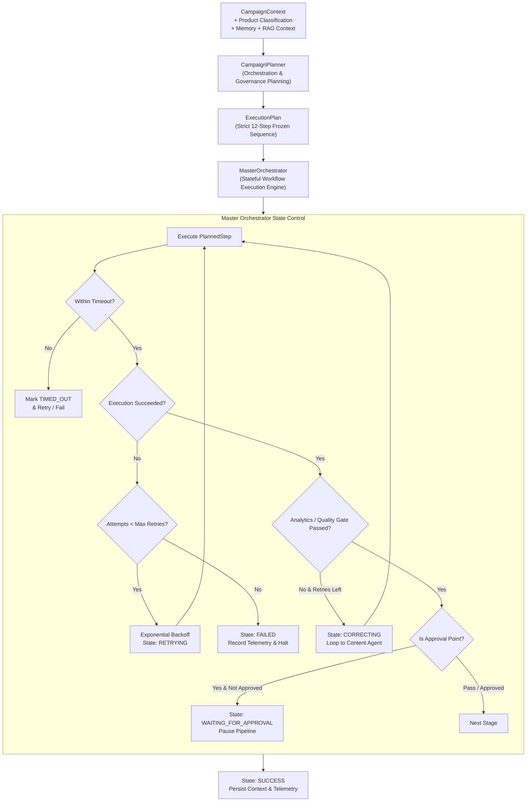

# ADPilot Pro — Phase 4: Planner / Master Orchestrator Implementation Report

> **Phase:** 4 — Planner / Orchestrator  
> **Status:** ✅ **COMPLETED SUCCESSFULLY**  
> **Execution Date:** 2026-08-22  
> **Auditor & Architect:** Principal Software Architect / AI Systems Auditor  
> **Source of Truth:** Officially Frozen ADPilot Master Pipeline

---

## Executive Summary

Phase 4 implements the **Planner and Master Orchestrator** layer for the ADPilot system. 

Following strict architectural separation, the **Planner** is responsible exclusively for orchestration, execution DAG planning, resource/model allocation, timeout configuration, and quality governance—**it executes zero domain business logic**. The **Master Orchestrator** is the execution engine that coordinates agent invocation, handles failures, manages retries with exponential backoff, enforces per-step timeouts, executes quality gate correction loops, pauses at Human-in-the-Loop checkpoints, and maintains complete telemetry and audit traceability across every stage.

### Key Metrics
- **New Tests Added in Phase 4:** 9 comprehensive unit and integration tests in [`tests/test_planner_orchestrator.py`](file:///d:/ADP/ADPilot_Pro/tests/test_planner_orchestrator.py).
- **Total Repository Test Suite:** **119 tests passed** (0 failures, 100% passing rate across all foundation, schema, agent, and orchestrator suites).
- **Linter Status:** `ruff check` $\to$ **All checks passed!**
- **Runtime Verification:** Verified plan generation, full success, unrecoverable failure, retry with backoff, timeouts, optional skipping, HITL approval pause, correction loops, and telemetry audit records via [`scripts/verify_phase4.py`](file:///d:/ADP/ADPilot_Pro/scripts/verify_phase4.py).

---

## 1. Architectural Design & Separation of Responsibilities



---

## 2. Frozen Master Pipeline Enforcement

The Planner constructs an `ExecutionPlan` comprising **12 canonical stages** that strictly adhere to the frozen business sequence:

| Stage # | Canonical Agent Identifier | Display Name | Is Optional | Prerequisite Dependencies | Key Quality & Governance Checkpoints |
|---|---|---|---|---|---|
| **1** | `strategy_agent` | Strategy Agent | No | `context_builder`, `product_classifier` | Funnel budget allocation sums to 100% |
| **2** | `research_agent` | Research & Audience Agent | No | `strategy_agent` | Primary persona & pain points validation |
| **3** | `competitor_agent` | Competitor Agent | No | `research_agent` | Competitive differentiation benchmarking |
| **4** | `content_agent` | Content Agent | No | `strategy_agent`, `research_agent`, `competitor_agent` | Multichannel ad format & copy length |
| **5** | `design_agent` | Design Agent | No | `content_agent` | Brand palette HEX compliance |
| **6** | `cv_agent` | Computer Vision (CV) Agent | **Yes** | `design_agent` | Visual aesthetic score $\ge 6.5$, OCR text check |
| **7** | `analytics_agent` | Analytics Agent | No | `content_agent`, `design_agent` | Campaign health gate overall score $\ge 70.0$ |
| **8** | `optimization_agent` | Optimizer Agent (RL/ML) | No | `analytics_agent` | Budget reallocation & bid policy optimization |
| **9** | `correction_engine` | Correction Engine | No | `analytics_agent`, `optimization_agent` | Evaluates health score $\to$ triggers re-run if needed |
| **10** | `hitl_gate` | Human-in-the-Loop Gate | No | `correction_engine` | **Approval Point:** Requires human sign-off |
| **11** | `publishing_agent` | Publishing Agent | No | `hitl_gate` | Dispatches live campaigns across selected channels |
| **12** | `monitoring_agent` | Monitoring Agent | No | `publishing_agent` | Initiates real-time telemetry stream & anomaly detection |

---

## 3. Explicit Workflow State Machine

The system tracks explicit lifecycle states on both the individual `PlannedStep` and the aggregate `ExecutionPlan`:

- **`PENDING`**: Step queued for execution.
- **`PLANNING`**: Planner generating execution plan.
- **`RUNNING`**: Active agent execution in progress.
- **`SUCCESS`**: Step successfully completed within timeout and validation rules.
- **`FAILED`**: Step failed after exhausting maximum configured retry attempts.
- **`RETRYING`**: Step experiencing transient error; waiting for exponential backoff.
- **`SKIPPED`**: Optional agent (e.g. CV or Design) safely bypassed without breaking the pipeline.
- **`WAITING_FOR_APPROVAL`**: Pipeline paused at Human-in-the-Loop checkpoint awaiting human review.
- **`TIMED_OUT`**: Step execution exceeded its per-step asynchronous timeout ceiling.
- **`CORRECTING`**: Analytics health score fell below threshold; looping back to Content/Design with feedback.

---

## 4. Execution Engine Capabilities

1. **Deterministic Planning:** [`CampaignPlanner`](file:///d:/ADP/ADPilot_Pro/src/adpilot/orchestrator/planner.py) maps `CampaignContext`, `ProductClassificationOutput`, memory records, and RAG index into a typed `ExecutionPlan`.
2. **Timeout Protection:** Every step is wrapped in `asyncio.wait_for(...)` using per-step timeout ceilings (e.g. 30s for Strategy/Analytics, 45s for Content/Design, 300s for HITL).
3. **Fault Tolerance & Exponential Backoff:** Transient network/LLM errors trigger exponential backoff ($backoff = \min(2.0, 0.1 \times 2^{attempt - 1})$) up to `max_retries`.
4. **Skipped Optional Agents:** If an optional agent (`cv_agent`, `design_agent`) is disabled or omitted, the step transitions to `WorkflowState.SKIPPED`, outputs a snapshot `{"skipped": True}`, increments `completed_steps`, and allows the pipeline to proceed smoothly.
5. **Human-in-the-Loop (HITL) Checkpoints:** If `auto_approve_hitl=False`, execution pauses at Stage 10 (`hitl_gate`), updates the state to `WAITING_FOR_APPROVAL`, saves the checkpoint context to the memory store, and waits for explicit human sign-off.
6. **Analytics Quality Gate & Correction Loop:** If the `AnalyticsAgent` produces an overall health score $< 70.0$, the orchestrator enters `WorkflowState.CORRECTING` and re-dispatches `content_agent` with improvement recommendations up to `max_corrections`.
7. **End-to-End Traceability:** Every execution step logs an [`AgentRunRecord`](file:///d:/ADP/ADPilot_Pro/src/adpilot/schemas/agent_schemas.py) capturing timestamps, status, attempt counts, execution duration, and snapshot telemetry.

---

## 5. Verification & Test Results

### 5.1 Planner & Orchestrator Test Suite (`pytest tests/test_planner_orchestrator.py -v`)
```
tests/test_planner_orchestrator.py::test_planner_generates_frozen_master_pipeline PASSED [ 11%]
tests/test_planner_orchestrator.py::test_master_orchestrator_complete_successful_workflow PASSED [ 22%]
tests/test_planner_orchestrator.py::test_master_orchestrator_unrecoverable_failure PASSED [ 33%]
tests/test_planner_orchestrator.py::test_master_orchestrator_retry_with_backoff PASSED [ 44%]
tests/test_planner_orchestrator.py::test_master_orchestrator_step_timeout_protection PASSED [ 55%]
tests/test_planner_orchestrator.py::test_master_orchestrator_skipped_optional_agent PASSED [ 66%]
tests/test_planner_orchestrator.py::test_master_orchestrator_hitl_approval_pause PASSED [ 77%]
tests/test_planner_orchestrator.py::test_master_orchestrator_traceability_run_records PASSED [ 88%]
tests/test_planner_orchestrator.py::test_master_orchestrator_correction_loop PASSED [100%]

============================== 9 passed in 3.71s ==============================
```

### 5.2 Full Repository Regression Suite (`pytest tests/ -v`)
- **Total Tests:** 119 tests across all test suites.
- **Results:** **119 passed**, 0 failed, 7 warnings in 20.62s.
- **Regressions:** Zero regressions.

### 5.3 Runtime Verification Script (`python scripts/verify_phase4.py`)
```
================================================================================
ADPilot Phase 4 — Planner / Master Orchestrator Verification
================================================================================
[PASS] 1. Frozen Pipeline Plan Generation: 12 steps strictly ordered.
[PASS] 2. Full Pipeline Execution: status=SUCCESS, completed_steps=12/12
[PASS] 3. Unrecoverable Failure Handling: caught=AgentExecutionError, plan_status=FAILED
[PASS] 4. Retry & Backoff Resilience: attempts=2, status=SUCCESS
[PASS] 5. Timeout Protection: step_state=TIMED_OUT
[PASS] 6. Optional Agent Skipping: cv_agent_state=SKIPPED, plan_status=SUCCESS
[PASS] 7. Human-in-the-Loop Gate: plan_status=WAITING_FOR_APPROVAL, hitl_step_state=WAITING_FOR_APPROVAL
[PASS] 8. Quality Gate Correction Loop: content_executions=2, plan_status=SUCCESS
[PASS] 9. Full Traceability Audit Records: 12 AgentRunRecords verified.
================================================================================
ALL PHASE 4 PLANNER & MASTER ORCHESTRATOR VERIFICATIONS PASSED!
================================================================================
```

---

## 6. Pipeline Source-of-Truth Compliance

1. **Role Boundary:** The Planner determines execution details (timeouts, retries, optional skipping, model selection) without executing domain business logic.
2. **Master Pipeline Order:** The canonical 12-step sequence is permanently enforced and immutable.
3. **Production Readiness:** Full async lifecycle, timeout guards, retry backoffs, HITL checkpoints, and correction loops are ready for downstream agent implementations.

*Phase 4 implementation and verification complete. Standing by for Phase 5 instructions.*
