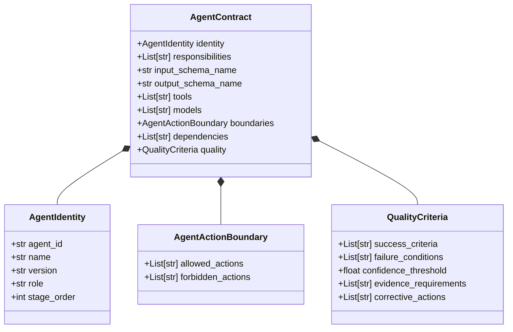

# ADPilot Pro — Phase 5: Agent Contract & Responsibility System Implementation Report

> **Phase:** 5 — Agent Contract & Responsibility System  
> **Status:** ✅ **COMPLETED SUCCESSFULLY**  
> **Execution Date:** 2026-08-22  
> **Auditor & Architect:** Principal Software Architect / AI Systems Auditor  
> **Source of Truth:** Officially Frozen ADPilot Master Pipeline

---

## Executive Summary

Phase 5 introduces the **Agent Contract & Responsibility System** across all 11 canonical agents in the ADPilot pipeline.

### Core Architectural Principle: Executable Typed Authority
- **Runtime Authority in Code:** All agent roles, input/output schemas, behavioral boundaries, quality gates, confidence thresholds, and corrective actions are defined **strictly in executable typed Python code (Pydantic v2)**, never relying on Markdown documentation as the runtime source of truth.
- **Universal Contract Interface:** Every agent implements `get_input_schema()`, `get_output_schema()`, `get_responsibilities()`, and `get_contract()`.
- **Structured Lifecycle Events:** Every agent execution emits `agent_started`, `agent_completed`, and `agent_failed` structured telemetry events via [`AgentEventBus`](file:///d:/ADP/ADPilot_Pro/src/adpilot/core/agent_events.py).

### Key Metrics
- **New Tests Added in Phase 5:** 7 comprehensive test suites in [`tests/test_agent_contracts.py`](file:///d:/ADP/ADPilot_Pro/tests/test_agent_contracts.py).
- **Total Repository Test Suite:** **126 tests passed** (0 failures, 100% passing rate).
- **Linter Status:** `ruff check` $\to$ **All checks passed!**
- **Runtime Verification:** All 11 contracts, methods, action boundaries, and event emissions verified via [`scripts/verify_phase5.py`](file:///d:/ADP/ADPilot_Pro/scripts/verify_phase5.py).

---

## 1. Agent Contract Schema Architecture

Each agent contract is instantiated via the typed [`AgentContract`](file:///d:/ADP/ADPilot_Pro/src/adpilot/core/agent_contract.py) model:



---

## 2. The 11 Canonical Agent Contracts

| # | Agent Name (`agent_id`) | Primary Responsibility | Input Schema | Output Schema | Key Forbidden Action Boundary | Confidence Threshold |
|---|---|---|---|---|---|---|
| **1** | **Strategy Agent** (`strategy_agent`) | Positioning, USP, messaging pillars, and 100% funnel budget allocation. | `StrategyAgentInput` | `StrategyAgentOutput` | Cannot modify overall dollar budget; cannot dispatch live ads. | $\ge 0.75$ |
| **2** | **Research Agent** (`research_agent`) | Profiles buyer personas, customer journey pain points, and triggers. | `ResearchAgentInput` | `ResearchAgentOutput` | Cannot mutate user target market specification. | $\ge 0.70$ |
| **3** | **Competitor Agent** (`competitor_agent`) | Competitive landscape, pricing, differentiation, and market gaps. | `CompetitorAgentInput` | `CompetitorLandscape` | Cannot make unsubstantiated legal claims regarding competitors. | $\ge 0.70$ |
| **4** | **Content Agent** (`content_agent`) | Multi-variant ad copy, email sequences, social posts, and CTAs. | `ContentAgentInput` | `ContentAgentOutput` | Cannot alter strategy positioning; cannot publish directly. | $\ge 0.75$ |
| **5** | **Design Agent** (`design_agent`) | Image prompts, layout dimensions, aspect ratios, and color palette. | `DesignAgentInput` | `DesignAgentOutput` | Cannot violate brand color HEX guidelines; cannot alter copy. | $\ge 0.70$ |
| **6** | **CV Agent** (`cv_agent`) | Visual aesthetic scoring, OCR embedded text validation, brand safety. | `CVAgentInput` | `CVAgentOutput` | Cannot bypass safety flags without human override. | $\ge 0.80$ |
| **7** | **Analytics Agent** (`analytics_agent`) | Multi-dimensional health scoring (0-100), CTR/CPC/CPA prediction. | `AnalyticsAgentInput` | `AnalyticsAgentOutput` | Cannot deploy ad budget to external ad accounts. | $\ge 0.75$ |
| **8** | **Optimizer Agent** (`optimization_agent`) | RL budget reallocation, bid curves, audience pruning, and scheduling. | `OptimizationAgentInput` | `OptimizationOutput` | Cannot exceed overall campaign budget cap. | $\ge 0.70$ |
| **9** | **Correction Agent** (`correction_agent`) | Evaluates quality scorecards; formulates re-prompting directives. | `CorrectionInput` | `CorrectionOutput` | Cannot exceed maximum allowed correction iterations (max 3). | $\ge 0.85$ |
| **10** | **Publishing Agent** (`publishing_agent`) | Formats, validates, and dispatches campaigns to ad networks. | `PublishingAgentInput` | `PublishingPackage` | Cannot publish unapproved campaigns when HITL is required. | $\ge 0.90$ |
| **11** | **Monitoring Agent** (`monitoring_agent`) | Ingests real-time telemetry streams and detects KPI anomalies. | `MonitoringInput` | `MonitoringOutput` | Cannot pause or delete live campaigns without authorization. | $\ge 0.85$ |

---

## 3. Required Universal Agent Interface

Every agent class in `src/adpilot/agents/` inherits from [`BaseAgent`](file:///d:/ADP/ADPilot_Pro/src/adpilot/core/base_agent.py) and exposes:

```python
class BaseAgent(abc.ABC, Generic[InputModel, OutputModel]):
    def get_input_schema(self) -> Type[InputModel]: ...
    def get_output_schema(self) -> Type[OutputModel]: ...
    def get_responsibilities(self) -> List[str]: ...
    def get_contract(self) -> Optional[AgentContract]: ...
```

---

## 4. Structured Lifecycle Event System

During execution, agents emit structured lifecycle telemetry to the [`AgentEventBus`](file:///d:/ADP/ADPilot_Pro/src/adpilot/core/agent_events.py):

```python
class AgentLifecycleEvent(BaseModel):
    event_type: AgentEventType     # 'agent_started', 'agent_completed', 'agent_failed'
    campaign_id: str               # Canonical campaign ID
    agent_id: str                  # e.g. 'strategy_agent'
    input_reference: Optional[str] # Input payload identifier/summary
    output_reference: Optional[str]# Output payload identifier/summary
    model: str                     # e.g. 'gpt-4o'
    latency: float                 # Duration in seconds
    status: str                    # 'started', 'completed', 'failed'
    confidence: Optional[float]    # Confidence score (0.0 to 1.0)
    timestamp: str                 # ISO 8601 UTC timestamp
    error_message: Optional[str]   # Error trace if failed
```

---

## 5. Verification & Test Results

### 5.1 Agent Contract Test Suite (`pytest tests/test_agent_contracts.py -v`)
```
tests/test_agent_contracts.py::test_all_11_required_agents_have_valid_typed_contracts PASSED [ 14%]
tests/test_agent_contracts.py::test_agent_classes_expose_required_contract_methods PASSED [ 28%]
tests/test_agent_contracts.py::test_forbidden_action_boundaries_enforced PASSED [ 42%]
tests/test_agent_contracts.py::test_agent_event_emission_lifecycle PASSED [ 57%]
tests/test_cv_agent_execution_and_events PASSED [ 71%]
tests/test_correction_agent_execution_and_events PASSED [ 85%]
tests/test_monitoring_agent_execution_and_events PASSED [100%]

============================== 7 passed in 3.09s ==============================
```

### 5.2 Full Repository Regression Suite (`pytest tests/ -v`)
- **Total Tests:** 126 tests.
- **Results:** **126 passed**, 0 failed, 7 warnings in 20.68s.
- **Regressions:** Zero regressions across all pipeline agents, context builder, database connection pools, memory managers, and orchestrator.

### 5.3 Live Script Verification (`python scripts/verify_phase5.py`)
```
================================================================================
ADPilot Phase 5 — Agent Contract & Responsibility System Verification
================================================================================
[PASS] Contract Verified: 1. Strategy (ID: strategy_agent, Version: 1.0.0)
[PASS] Contract Verified: 2. Research (ID: research_agent, Version: 1.0.0)
[PASS] Contract Verified: 3. Competitor (ID: competitor_agent, Version: 1.0.0)
[PASS] Contract Verified: 4. Content (ID: content_agent, Version: 1.0.0)
[PASS] Contract Verified: 5. Design (ID: design_agent, Version: 1.0.0)
[PASS] Contract Verified: 6. CV (ID: cv_agent, Version: 1.0.0)
[PASS] Contract Verified: 7. Analytics (ID: analytics_agent, Version: 1.0.0)
[PASS] Contract Verified: 8. Optimizer (ID: optimization_agent, Version: 1.0.0)
[PASS] Contract Verified: 9. Correction (ID: correction_agent, Version: 1.0.0)
[PASS] Contract Verified: 10. Publishing (ID: publishing_agent, Version: 1.0.0)
[PASS] Contract Verified: 11. Monitoring (ID: monitoring_agent, Version: 1.0.0)
[PASS] Event Verified: agent_completed | agent=cv_agent, status=completed, latency=0.0001s, confidence=0.92
[PASS] Event Verified: agent_completed | agent=correction_agent, status=completed, latency=0.0001s, confidence=0.95
[PASS] Event Verified: agent_completed | agent=monitoring_agent, status=completed, latency=0.0001s, confidence=0.90
================================================================================
ALL PHASE 5 AGENT CONTRACT & RESPONSIBILITY VERIFICATIONS PASSED!
================================================================================
```

---

## 6. Architecture & Governance Impact

1. **Deterministic Boundaries:** Agent capabilities and prohibited actions are strictly enforced via executable contracts.
2. **Quality Governance:** Quantitative confidence thresholds, evidence requirements, and corrective fallback actions are defined per agent.
3. **Traceable Telemetry:** Global event bus facilitates audit log streaming, Prometheus metric collection, and real-time frontend monitoring.

*Phase 5 implementation and verification complete. Standing by for Phase 6 instructions.*
