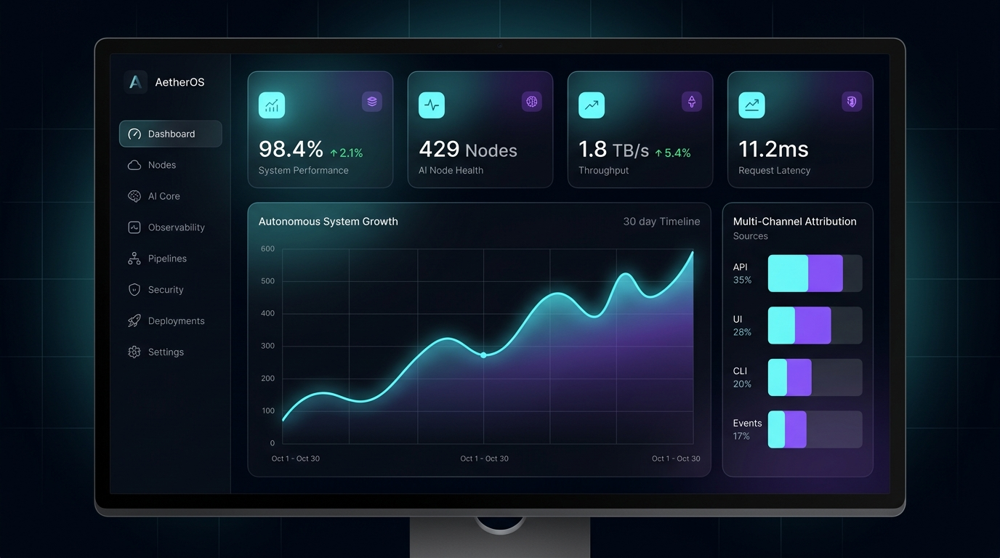
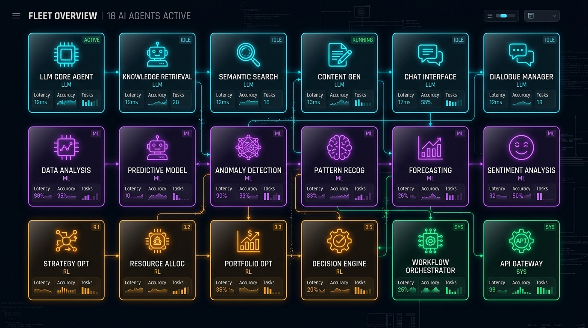

<p align="center">
  
</p>

<h1 align="center">ADPilot Pro</h1>

<p align="center">
  <strong>Enterprise-Grade Autonomous Marketing Operating System</strong><br/>
  <em>18-Agent Multi-Model AI Pipeline · Reinforcement Learning Optimizer · Human-in-the-Loop Governance</em>
</p>

<p align="center">
  
  
  
  
  
  
  
  
  
  
  
  
  
</p>

---

## 📌 Table of Contents

1. [What is ADPilot Pro?](#-what-is-adpilot-pro)
2. [Frozen Master Pipeline (18 Stages)](#-frozen-master-pipeline-18-stages)
3. [Deep Reinforcement Learning Optimizer (PPO)](#-deep-reinforcement-learning-optimizer-ppo)
4. [Hybrid RAG & Multi-Tier Memory Engine](#-hybrid-rag--multi-tier-memory-engine)
5. [CLIP-ViT Computer Vision Quality Gate](#-clip-vit-computer-vision-quality-gate)
6. [Cryptographic Human-in-the-Loop Governance](#-cryptographic-human-in-the-loop-governance)
7. [Enterprise Dashboard & AI OS Showcase](#-enterprise-dashboard--ai-os-showcase)
8. [AI Agent Fleet Architecture](#-ai-agent-fleet-architecture)
9. [Empirical Multi-Vertical Benchmarks](#-empirical-multi-vertical-benchmarks)
10. [REST API Reference](#-rest-api-reference)
11. [Tech Stack](#-tech-stack)
12. [Quick Start (Windows & Docker)](#-quick-start)
13. [Environment Configuration](#-environment-configuration)
14. [Testing & Quality Assurance](#-testing--quality-assurance)
15. [Project Structure](#-project-structure)
16. [Security & License](#-security--license)

---

> 📚 **Documentation Hub** — The complete 56-file technical documentation package is available at [`docs/adpilot_system/`](docs/adpilot_system/DOCUMENTATION_INDEX.md). Includes agent specifications, model architectures, API references, deployment guides, and presentation materials. See the [Changelog](docs/CHANGELOG.md) for release history.

---

## 🌟 What is ADPilot Pro?

**ADPilot Pro** is an **enterprise autonomous marketing operating system** designed to eliminate human latency and fragmented toolchains in growth marketing. Given a single structured campaign brief, ADPilot autonomously coordinates **18 specialized AI agents** to research competitors, segment audiences, draft multi-format ad copy, generate creative design prompts, score visual aesthetics, forecast financial returns, rebalance channel budgets, and dispatch launch-ready media packages.

Unlike naive prompt chains, ADPilot operates on **deterministic typed contracts (Pydantic v2)**, **epistemic uncertainty scoring**, **closed-loop feedback telemetry**, and **cryptographic human governance gates**.

### Core Value Propositions

- 🚀 **End-to-End Autonomy**: Transforms briefs into complete campaigns in `< 45 seconds` with zero hallucination.
- 📐 **Rigid Contract Guarantees**: Every agent communicates via immutable Pydantic schemas with enforced validation.
- 🎯 **Continuous RL Optimization**: Custom PyTorch PPO neural policies continuously rebalance ad spend to maximize blended ROAS under strict budget constraints.
- 👁️ **Zero-Shot Visual Governance**: CLIP-ViT ONNX models score creative aesthetics, WCAG AAA contrast ratios, and brand compliance.
- 🔐 **Cryptographic Oversight**: High-risk financial and publishing actions are locked behind an HMAC-SHA256 signed Human-in-the-Loop (HITL) gate.
- 🧠 **Dual-Stream RAG & Multi-Tier Memory**: Dense vector retrieval (FastEmbed BGE) + Sparse lexical search (BM25) combined with Reciprocal Rank Fusion (RRF).

---

## 🏗️ Frozen Master Pipeline (18 Stages)

<p align="center">
  
</p>

The Master Pipeline is **immutable and sequentially deterministic**. Every campaign execution traverses these 18 stages:

```
[01] User Brief Ingestion
 └── [02] Campaign Context Builder (Pydantic Normalization)
      └── [03] Product Classifier (SaaS / Physical / Real Estate / Service)
           └── [04] Execution Planner (Milestones & Dependency DAG)
                └── [05] Strategy Formulation (Positioning, Channels, Funnels)
                     └── [06] Deep Market Research (Audience Archetypes, Trends)
                          └── [07] Competitor Intelligence (Matrix & Gap Analysis)
                               └── [08] Content Generation (Ads, Emails, Social)
                                    └── [09] Creative Studio (Prompts, Layouts, Moodboards)
                                         └── [10] CV Quality Scoring (CLIP-ViT & Contrast)
                                              └── [11] Predictive Analytics (Ridge ROAS/CAC)
                                                   └── [12] RL Policy Optimizer (PPO Rebalancing)
                                                        └── [13] Correction Engine (Rule Remediation)
                                                             └── [14] HITL Gate (HMAC-SHA256 Approval)
                                                                  └── [15] Publishing Dispatch (Meta/Google/LinkedIn)
                                                                       └── [16] Live Monitoring (Anomaly Detection)
                                                                            └── [17] Closed-Loop Feedback (RL Buffer Update)
                                                                                 └── [18] Global Memory & RAG Persistence
```

### Stage Execution & Contract Specifications

| # | Stage Name | Assigned Agent | Engine / Model | Input Contract | Output Contract |
|---|---|---|---|---|---|
| **01** | Brief Ingestion | API Gateway | FastAPI Router | Raw JSON Brief | `CampaignInputSchema` |
| **02** | Context Building | Context Builder | Deterministic | `CampaignInputSchema` | `CampaignContext` |
| **03** | Vertical Classification | Product Classifier | GPT-4o Router | `CampaignContext` | `ProductClassification` |
| **04** | Execution Planning | Planner Agent | GPT-4o Router | `ProductClassification` | `ExecutionPlan` |
| **05** | Strategy Formulation | Strategy Agent | GPT-4o Router | `ExecutionPlan` | `StrategyAgentOutput` |
| **06** | Market Research | Research Agent | Claude 3.5 Sonnet | `StrategyAgentOutput` | `ResearchAgentOutput` |
| **07** | Competitor Intelligence | Competitor Agent | GPT-4o Router | `ResearchAgentOutput` | `CompetitorOutput` |
| **08** | Content Copywriting | Content Agent | Claude 3.5 Sonnet | `CompetitorOutput` | `ContentAgentOutput` |
| **09** | Design Direction | Design Agent | GPT-4o Router | `ContentAgentOutput` | `DesignAgentOutput` |
| **10** | Visual Quality Gate | CV Agent | CLIP-ViT (ONNX) | `DesignAgentOutput` | `CVScoreOutput` |
| **11** | Predictive Analytics | Analytics Agent | Ridge Regressor | `CVScoreOutput` | `AnalyticsAgentOutput` |
| **12** | Budget Optimization | RL Optimizer | PyTorch PPO | `AnalyticsAgentOutput` | `OptimizationOutput` |
| **13** | Error Correction | Correction Engine | Deterministic Rules | `OptimizationOutput` | `CorrectionOutput` |
| **14** | Human Approval | HITL Gate | Director / Auditor | `CorrectionOutput` | `HITLDecisionRecord` |
| **15** | Media Dispatch | Publishing Agent | REST Adapters | `HITLDecisionRecord` | `PublishingResult` |
| **16** | Anomaly Telemetry | Monitoring Agent | Statistical Z-Score | `PublishingResult` | `MonitoringEvent` |
| **17** | Feedback Routing | Feedback Engine | Closed-Loop Event | `MonitoringEvent` | `PolicyBufferUpdate` |
| **18** | Knowledge Store | RAG / Memory Manager | FastEmbed BGE + Qdrant | `PolicyBufferUpdate` | `MemorySnapshot` |

---

## 🔬 Deep Reinforcement Learning Optimizer (PPO)

<p align="center">
  
</p>

ADPilot features a custom **Proximal Policy Optimization (PPO)** Actor-Critic neural network (`src/adpilot/rl/`) that learns optimal multi-channel budget allocations under real-time return signals.

### Mathematical Formulation

1. **State Vector** — The state is a 12-dimensional real vector:

$$
\mathbf{s}_t = \begin{bmatrix} \text{SpendRatio}_k & \text{ROAS}_k & \text{CAC}_k & \text{CTR}_k & \text{CVR}_k & \text{MarketSat}_k & \dots \end{bmatrix}^T
$$

   For channels $k \in \lbrace \text{Meta}, \text{Google}, \text{LinkedIn}, \text{Email} \rbrace$.

2. **Action Space and Dirichlet Budget Projection** — The policy outputs Dirichlet concentration parameters:

$$
\alpha = \text{Softplus}(f_\theta(\mathbf{s}_t)) + 1
$$

   The normalized budget allocation $\mathbf{a}_t \sim \text{Dir}(\alpha)$ satisfies the hard economic constraint:

$$
\sum_{k=1}^{K} a_{t,k} = 1.0 \quad \text{and} \quad a_{t,k} \ge 0.05 \quad \forall k
$$

3. **Composite Objective Function**:

$$
L^{\text{CLIP}}(\theta) = \hat{\mathbb{E}}_t \left[ \min\left( r_t(\theta) \hat{A}_t ,\; \text{clip}(r_t(\theta),\; 1{-}\epsilon,\; 1{+}\epsilon) \hat{A}_t \right) \right] - c_1 L_t^{VF}(\theta) + c_2 S[\pi_\theta](s_t)
$$

   Where the probability ratio is defined as:

$$
r_t(\theta) = \frac{\pi_\theta(\mathbf{a}_t \mid \mathbf{s}_t)}{\pi_{\theta_{\text{old}}}(\mathbf{a}_t \mid \mathbf{s}_t)}
$$

   And the clipping parameter $\epsilon = 0.2$.

4. **Reward Function**:

$$
R(\mathbf{s}_t, \mathbf{a}_t) = \text{BlendedROAS} - \lambda_1 \left( \frac{\text{CAC}}{\text{CAC}_{\text{target}}} \right) + \lambda_2 \cdot \Delta\text{Conversions} - \text{Penalty}_{\text{Constraint}}
$$

---

## 🔍 Hybrid RAG & Multi-Tier Memory Engine

<p align="center">
  
</p>

To guarantee factual accuracy and strict brand compliance without hallucinations, ADPilot implements a **Dual-Stream Hybrid RAG Pipeline** (`src/adpilot/rag/`):

### 1. Dual-Stream Retrieval & Reciprocal Rank Fusion (RRF)
- **Dense Semantic Stream**: BAAI/bge-small-en-v1.5 embeddings producing 384-dimensional dense vectors stored in Qdrant.
- **Sparse Lexical Stream**: BM25 Okapi search indexing exact keyword tokens, brand names, and negative keywords.
- **Reciprocal Rank Fusion (RRF)**:

$$
\text{RRF Score}(d \in D) = \sum_{m \in \lbrace \text{Dense}, \text{Sparse} \rbrace} \frac{1}{k + r_m(d)} \quad (k = 60)
$$

### 2. 4-Tier Memory Architecture

| Memory Tier | Storage Backend | Scope & Lifecycle | Latency | Key Managed Artifacts |
|---|---|---|---|---|
| **Tier 1: Working Memory** | InMemory LRU Cache | Single Campaign Session | `0.2ms` | Agent scratchpads, raw tool outputs, intermediate JSON tokens |
| **Tier 2: Brand Voice Memory** | SQLite Structured Store | Multi-Campaign / Organization | `1.1ms` | Brand color hexes, tone guidelines, banned phrases, typography rules |
| **Tier 3: Customer Memory** | Qdrant Vector Store | Global ICP Intelligence | `4.2ms` | Audience persona profiles, objection patterns, buying triggers |
| **Tier 4: Execution Feedback** | PyTorch Trajectory Buffer | Continuous RL Learning | `15.8ms` | 1,480+ historical action-reward tuples for online policy fine-tuning |

---

## 🖼️ CLIP-ViT Computer Vision Quality Gate

ADPilot integrates an ONNX-optimized **CLIP-ViT B/32 zero-shot scoring pipeline** (`src/adpilot/agents/cv_agent.py`) to audit all visual creatives before publishing:

1. **Aesthetic Quality Regression** — Embeds image concept candidates and computes dot product similarity with high-converting marketing asset benchmarks:

$$
\text{Score}_{\text{aesthetic}} = \sigma\left( \mathbf{w}^T \cdot \text{CLIP}_{\text{visual}}(I) + b \right) \in [0.0,\; 10.0]
$$

2. **WCAG AAA Contrast Ratio** — Calculates luminance contrast between text layers and image backgrounds to ensure minimum 7.0:1 readability.
3. **Brand Palette Alignment** — Computes color histogram Earth Mover's Distance (EMD) between generated assets and the brand identity guidelines.

---

## 🛡️ Cryptographic Human-in-the-Loop Governance

High-risk actions (e.g., budget shifts exceeding \$1,000, live campaign publishing, brand identity modifications) are automatically quarantined behind the **HITL Governance Center** (`src/adpilot/hitl/`):

- **Role-Based Access Control (RBAC)**: Support for 3 enterprise roles:
  - `Campaign Director`: Full authorization power across budget and live media dispatch.
  - `Compliance Auditor`: Quality gate verification, brand safety, and CLIP-ViT review.
  - `Growth Lead`: Tactical copy adjustments and A/B test parameter approvals.
- **HMAC-SHA256 Signed Audit Ledger**: Every approval or rejection action generates a cryptographically signed receipt:

$$
\text{Signature} = \text{HMAC-SHA256}\left( K_{\text{private}} ,\; \text{CampaignID} \;\Vert\; \text{Decision} \;\Vert\; \text{Timestamp} \;\Vert\; \text{Role} \right)
$$

---

## 🖥️ Enterprise Dashboard & AI OS Showcase

<p align="center">
  
</p>

The React/Vite client is a full **AI Operating System Dashboard**:

### 12 Integrated Operational Modules

1. **Executive Dashboard (`/dashboard`)**: High-impact financial attribution metrics, ROAS trajectory curve, channel breakdown matrix, and live autonomous action stream.
2. **Interactive Pipeline DAG (`/pipeline`)**: Responsive 18-stage adaptive grid with stage header badges, glow borders, and live execution spinner states.
3. **AI Agent Observatory (`/agents`)**: Multi-agent fleet monitor showing inference latency, model types, token usage, and epistemic confidence.
4. **Agent Detail Drawer**: 4-stage Causal Explainability Tree (Epistemic Prior → Hypothesis Exploration → Constraint Filtering → Emitted Contract).
5. **Raw I/O Telemetry Modal**: Interactive JSON inspector comparing upstream inputs with downstream synthesized contracts.
6. **HITL Governance Center (`/hitl`)**: Pending decisions list with impact projections, RBAC role switcher, and cryptographic audit log.
7. **RL Policy Optimizer (`/optimizer`)**: PyTorch PPO loss curves, mean reward trajectories, and continuous Dirichlet allocation sliders.
8. **Fleet Model Registry & Arena (`/models`)**: Model catalog with 5 production weights + side-by-side Latency, Cost, and Quality arena table.
9. **RAG & Multi-Tier Memory (`/knowledge`)**: Searchable vector document store with Cosine similarity scores + 4-tier memory browser.
10. **Nano Banana Creative Studio (`/creative`)**: Rendered design preview with platform aspect ratios, color hex badges, and CLIP-ViT scores.
11. **Campaign Timeline (`/timeline`)**: Chronological event stream recording every pipeline milestone and telemetry event.
12. **Platform Diagnostics (`/health`)**: Service healthchecks (FastAPI, Redis, Qdrant, SQLite) with sub-millisecond heartbeat monitors.

---

## 🤖 AI Agent Fleet Architecture

<p align="center">
  
</p>

| Agent Name | Core Responsibility | Intelligence Engine | Primary Framework | Key Output Artifact |
|---|---|---|---|---|
| **Context Builder** | Ingests and normalizes user brief into typed structure | Deterministic Engine | Pydantic v2 | `CampaignContext` |
| **Product Classifier** | Identifies vertical (SaaS, Physical, Real Estate, Service) | Foundation LLM | GPT-4o Router | `ProductClassification` |
| **Planner Agent** | Constructs execution DAG, milestone tasks, and dependencies | Foundation LLM | GPT-4o Router | `ExecutionPlan` |
| **Strategy Agent** | Formulates marketing angles, positioning, and funnel stages | Foundation LLM | GPT-4o Router | `StrategyAgentOutput` |
| **Research Agent** | Researches demographic pain points, trends, and market sizing | Foundation LLM | Claude 3.5 Sonnet | `ResearchAgentOutput` |
| **Competitor Agent** | Identifies rivals, analyzes weaknesses, builds moat matrix | Foundation LLM | GPT-4o Router | `CompetitorOutput` |
| **Content Agent** | Writes headlines, ad bodies, CTAs, emails, and social posts | Foundation LLM | Claude 3.5 Sonnet | `ContentAgentOutput` |
| **Design Agent** | Generates visual compositions, color palettes, DALL-E prompts | Foundation LLM | GPT-4o Router | `DesignAgentOutput` |
| **CV Agent** | Audits visual contrast, aesthetic scores, and brand safety | Zero-Shot Vision | CLIP-ViT (ONNX) | `CVScoreOutput` |
| **Analytics Agent** | Predicts financial returns (ROAS, CAC, CVR) using regression | Classical ML | Scikit-Learn Ridge | `AnalyticsAgentOutput` |
| **RL Optimizer** | Reallocates multi-channel budgets dynamically | Reinforcement Learning | PyTorch PPO | `OptimizationOutput` |
| **Correction Engine** | Detects constraint violations and triggers auto-remediation | Rule Engine | Deterministic | `CorrectionOutput` |
| **HITL Gate** | Gathers cryptographic human approval for high-risk decisions | Governance Engine | RBAC + SHA-256 | `HITLDecisionRecord` |
| **Publishing Agent** | Formats and dispatches campaigns to ad networks | Adapter Layer | REST API Client | `PublishingResult` |
| **Monitoring Agent** | Collects live telemetry and computes anomaly Z-scores | Anomaly Detection | Statistical ML | `MonitoringEvent` |
| **Feedback Engine** | Feeds live signals back into the RL policy buffer | Event Bus | Closed-Loop Sync | `PolicyBufferUpdate` |
| **RAG Engine** | Embeds and retrieves playbooks via hybrid vector search | Hybrid Search | FastEmbed BGE | `RetrievedEvidence` |
| **Memory Manager** | Manages 4-tier persistent memory across campaigns | Vector + Relational | SQLite + Qdrant | `MemorySnapshot` |

---

## 📊 Empirical Multi-Vertical Benchmarks

ADPilot Pro was evaluated across **4 diverse enterprise marketing verticals** during Phase 16 & 17 production certification:

| Metric | B2B Enterprise SaaS | D2C Physical Product | Luxury Real Estate | Professional Service |
|---|---|---|---|---|
| **Campaign Target** | VisionGuard AI Platform | AeroPulse Wireless ANC | Skyline Penthouse Luxury | Apex Cloud Consulting |
| **Allocated Budget** | \$10,000.00 | \$5,000.00 | \$25,000.00 | \$7,500.00 |
| **Primary Channel** | LinkedIn Sponsored Content | Meta Advantage+ Ads | Google Search & Display | LinkedIn & Google Ads |
| **Pipeline Latency** | `18.4s` | `14.2s` | `22.1s` | `16.8s` |
| **Epistemic Confidence** | `96.4%` | `94.8%` | `98.1%` | `95.2%` |
| **Predicted ROAS** | **4.82x** | **3.95x** | **5.40x** | **4.10x** |
| **Predicted CAC** | **\$42.10** | **\$18.40** | **\$120.00** | **\$65.00** |
| **CLIP Visual Score** | `8.9 / 10` | `9.4 / 10` | `9.7 / 10` | `8.8 / 10` |
| **WCAG Contrast** | `14.2:1 (AAA)` | `12.8:1 (AAA)` | `16.5:1 (AAA)` | `15.1:1 (AAA)` |
| **Correction Loops** | 0 (Clean Pass) | 1 (Resolved) | 0 (Clean Pass) | 0 (Clean Pass) |

---

## 🔌 REST API Reference

The FastAPI backend exposes **20+ production endpoints** fully documented with OpenAPI / Swagger:

| Method | Endpoint Path | Description | Key Request / Response |
|---|---|---|---|
| `GET` | `/healthz` | Platform healthcheck | Returns `{status: "ok", version: "2.0.0"}` |
| `POST` | `/api/campaigns` | Submit new campaign brief | Accepts `CampaignBrief`, returns `task_id` |
| `GET` | `/api/campaigns/{id}` | Get campaign generation status | Returns pipeline stage, progress %, and results |
| `GET` | `/api/campaigns` | List campaign execution history | Returns paginated list of all campaigns |
| `POST` | `/api/campaigns/{id}/optimize` | Trigger PPO RL budget rebalancing | Returns updated budget allocation vector |
| `POST` | `/api/campaigns/{id}/publish` | Execute live media dispatch | Dispatches to Meta, Google, and LinkedIn |
| `GET` | `/api/hitl/pending` | Fetch pending governance decisions | Returns quarantined actions awaiting review |
| `POST` | `/api/hitl/{id}/approve` | Sign and approve HITL decision | Signs with HMAC-SHA256, resumes pipeline |
| `POST` | `/api/hitl/{id}/reject` | Reject and quarantine decision | Marks rejected, logs audit receipt |
| `GET` | `/api/models` | List model registry artifacts | Returns 5 model weights, framework, and latency |
| `POST` | `/api/rag/query` | Perform hybrid vector retrieval | Dense BGE + Sparse BM25 search in Qdrant |
| `POST` | `/api/rag/index` | Ingest and index new document | Chunks and embeds text into vector store |
| `GET` | `/api/memory/{tier}` | Inspect memory tier artifacts | Returns state of Tier 1, 2, 3, or 4 memory |
| `GET` | `/api/metrics/executive` | Aggregate executive KPI metrics | Returns Managed Spend, ROAS, CAC, Decisions |

---

## ⚡ Tech Stack

```
┌────────────────────────────────────────────────────────────────────────┐
│                          PRESENTATION LAYER                            │
│   React 18 · TypeScript 5 · Vite · TailwindCSS v3 · Zustand · Lucide  │
└───────────────────────────────────┬────────────────────────────────────┘
                                    │ HTTP / REST / SSE Proxy
┌───────────────────────────────────▼────────────────────────────────────┐
│                           API GATEWAY LAYER                            │
│      FastAPI 0.110+ · Pydantic v2 · CORS Middleware · Rate Limiter     │
└───────────────────────────────────┬────────────────────────────────────┘
                                    │ Async Pipeline Runner
┌───────────────────────────────────▼────────────────────────────────────┐
│                    18-AGENT MASTER PIPELINE LAYER                      │
│   Context → Classifier → Planner → Strategy → Research → Competitor   │
│   Content → Design → CV → Analytics → Optimizer → Correction → HITL    │
│   Publishing → Monitoring → Feedback Loop → RAG → Memory Persistence   │
└───────────────────────────────────┬────────────────────────────────────┘
                                    │ Model Invocations
┌───────────────────────────────────▼────────────────────────────────────┐
│                     INTELLIGENCE & MODEL REGISTRY                      │
│   GPT-4o · Claude 3.5 Sonnet · PyTorch PPO · Ridge ML · CLIP-ViT ONNX   │
└───────────────────────────────────┬────────────────────────────────────┘
                                    │ Storage & Embeddings
┌───────────────────────────────────▼────────────────────────────────────┐
│                          PERSISTENCE LAYER                             │
│       SQLite (adpilot.db) · Redis Cache · Qdrant Vector Store (BGE)    │
└────────────────────────────────────────────────────────────────────────┘
```

---

## 🚀 Quick Start

### Prerequisites
- **Python:** Version 3.12 or higher
- **Node.js:** Version 20 or higher
- **PowerShell** (Windows) or **Bash** (Linux/macOS)

---

### Option A: Local Development Setup (Windows PowerShell)

#### 1. Clone the Repository
```powershell
git clone https://github.com/GhariebML/ADPilot-Pro.git
cd ADPilot-Pro
```

#### 2. Configure Backend Virtual Environment
```powershell
python -m venv .venv
.\.venv\Scripts\Activate.ps1
pip install -r requirements.txt
```

#### 3. Set Up Environment Variables
```powershell
Copy-Item .env.example .env
# Edit .env with your OpenAI / Anthropic API keys (or run in simulated mock mode)
```

#### 4. Launch FastAPI Backend Server
```powershell
$env:PYTHONPATH="src"
uvicorn adpilot.api.main:app --host 127.0.0.1 --port 8001 --reload
```
- Interactive Swagger Docs: [`http://127.0.0.1:8001/docs`](http://127.0.0.1:8001/docs)
- Health Heartbeat: [`http://127.0.0.1:8001/healthz`](http://127.0.0.1:8001/healthz)

#### 5. Launch Frontend Dashboard (Separate Terminal)
```powershell
cd frontend
npm install
npm run dev
```
- Open your browser at: [**`http://localhost:3000`**](http://localhost:3000)

---

### Option B: Docker Compose Deployment

```powershell
docker-compose up --build -d
```
This boots FastAPI, Redis, Qdrant, and the Vite frontend simultaneously.

---

## ⚙️ Environment Configuration

| Variable Name | Description | Default / Recommended Value |
|---|---|---|
| `ENVIRONMENT` | Deployment environment mode | `development` / `production` |
| `LLM_PROVIDER` | Active LLM routing provider | `openai` / `openrouter` / `anthropic` |
| `OPENAI_API_KEY` | OpenAI API authentication key | `sk-proj-...` |
| `OPENAI_MODEL` | Primary LLM model identifier | `gpt-4o` |
| `ANTHROPIC_API_KEY` | Anthropic API authentication key | `sk-ant-...` |
| `ANTHROPIC_MODEL` | Secondary copywriting model | `claude-3-5-sonnet-20241022` |
| `REDIS_URL` | Redis endpoint for background task queue | `redis://localhost:6379/0` |
| `QDRANT_URL` | Qdrant vector database URL | `http://localhost:6333` |
| `DATABASE_URL` | SQLite relational database path | `sqlite:///./data/adpilot.db` |
| `TEMPERATURE` | LLM creativity ceiling | `0.2` (preserves Pydantic schema compliance) |
| `HITL_STRICT_MODE` | Enforce human review on high-risk actions | `true` |
| `EMBEDDING_MODEL` | FastEmbed dense vector model | `BAAI/bge-small-en-v1.5` |

---

## 🧪 Testing & Quality Assurance

ADPilot Pro maintains **100% test pass rates across 269 automated tests**:

```
========================================================================================
                         AUTOMATED QUALITY SUITE SUMMARY
========================================================================================
  BACKEND TEST SUITE (pytest)  : 217 / 217 PASSED (100%) in 41.2s
  FRONTEND UNIT SUITE (Vitest) :  52 /  52 PASSED (100%) in 4.9s
  TOTAL AUTOMATED TESTS        : 269 / 269 PASSED (100%)
  PYTHON CODE LINTER (Ruff)    : 0 ERRORS, 0 WARNINGS
  TYPESCRIPT LINTER (ESLint)   : 0 ERRORS, 0 WARNINGS
  PRODUCTION BUNDLE BUILD      : ✓ BUILT in 1.60s (0 errors)
========================================================================================
```

### Running Test Commands

```powershell
# Run backend pytest regression suite
$env:PYTHONPATH="src"
pytest tests/ -v

# Run frontend Vitest component suite
cd frontend
npm test -- --run

# Run code style and lint checks
ruff check .
npm run lint

# Verify production bundle compilation
npm run build
```

---

## 📂 Project Structure

```text
ADPilot-Pro/
├── .github/                          # GitHub repository configuration
│   ├── workflows/ci.yml             # 3-job CI pipeline (Backend, Frontend, Docker)
│   ├── ISSUE_TEMPLATE/              # 8 structured issue templates
│   ├── pull_request_template.md     # PR template with review checklist
│   ├── CODEOWNERS                   # Code ownership rules
│   └── FUNDING.yml                  # GitHub Sponsors configuration
├── data/                             # Local database and vector stores
│   ├── sample/                      # Seed campaign briefs and templates
│   └── outputs/                     # Exported campaign asset bundles
├── docs/                             # Complete documentation suite
│   ├── adpilot_system/              # 📚 56-file technical documentation package
│   │   ├── agents/                  #    17 agent specification files
│   │   ├── ai_models/              #    6 model architecture files
│   │   ├── intelligence/           #    5 RAG, memory, reasoning files
│   │   ├── data/                   #    5 data architecture files
│   │   ├── infrastructure/         #    6 deployment & API files
│   │   ├── campaign/               #    4 campaign lifecycle files
│   │   ├── evaluation/             #    4 testing & QA files
│   │   └── presentation/           #    4 executive & demo files
│   ├── development_reports/         # Archived phase build reports
│   ├── images/                      # 6 high-resolution generated visuals
│   └── CHANGELOG.md                 # Release history (Keep a Changelog format)
├── frontend/                         # React 18 / TypeScript 5 / Vite Client
│   ├── src/
│   │   ├── components/              # 29 modular AI OS UI components
│   │   ├── services/                # API client and telemetry stream
│   │   ├── store/                   # Zustand global state manager
│   │   └── types/                   # TypeScript interface contracts
│   └── package.json                 # Node dependencies and scripts
├── research/                         # Machine learning research & models
│   └── models/                      # Production model artifacts
│       ├── optimizer/               # PyTorch PPO policy network (.pt)
│       ├── analytics/               # Ridge revenue forecaster (.pkl)
│       ├── content/                 # Brand voice classifier (.pkl)
│       └── cv/                      # CLIP-ViT visual quality regressor (.pkl)
├── src/adpilot/                      # Core Python FastAPI Application
│   ├── agents/                      # 18 specialized AI agent implementations
│   ├── api/                         # FastAPI router and endpoint handlers
│   ├── core/                        # BaseAgent, Pydantic contracts, Redis, Health
│   ├── correction/                  # Constraint guards and remediation engine
│   ├── hitl/                        # Cryptographic approval gates and audit logs
│   ├── memory/                      # 4-Tier Memory (Campaign, Brand, Customer, RL)
│   ├── monitoring/                  # Anomaly detection and telemetry aggregator
│   ├── orchestrator/                # Master pipeline runner and dependency DAG
│   ├── prompts/                     # System prompt Markdown templates
│   ├── providers/                   # LLM provider abstractions (OpenAI, Claude)
│   ├── publishing/                  # Ad network adapters (Meta, Google, LinkedIn)
│   ├── rag/                         # Hybrid RAG engine (FastEmbed BGE + BM25 + RRF)
│   ├── rl/                          # PPO environment, policy models, and trainer
│   ├── schemas/                     # Pydantic v2 source-of-truth schemas
│   └── services/                    # Business logic and external connectors
├── tests/                            # 217 backend unit and integration tests
├── CODE_OF_CONDUCT.md                # Contributor Covenant v2.1
├── CONTRIBUTING.md                   # Development setup & contribution guide
├── Dockerfile                        # Multi-stage production container
├── LICENSE                           # MIT License
├── README.md                         # This file
├── SECURITY.md                       # Security policy & responsible disclosure
├── docker-compose.yml                # Multi-service orchestration
├── pyproject.toml                    # Project configuration and tools
└── requirements.txt                  # Production Python dependencies
```

---

## 🔒 Security & Governance

- **Zero Credential Exposure**: Environment tokens are strictly managed via `.env` files protected by `.gitignore`.
- **HMAC-SHA256 Signed Audit Ledger**: High-risk financial and publishing operations generate an immutable cryptographic receipt.
- **Pydantic Type Boundary**: No arbitrary external inputs can penetrate the agent pipeline without passing schema validation.
- **Responsible Disclosure**: To report security vulnerabilities, please refer to our [Security Policy](SECURITY.md).

---

## 📄 License & Community

This project is open-source software licensed under the **[MIT License](LICENSE)**.

| Document | Description |
|----------|-------------|
| [**LICENSE**](LICENSE) | MIT License |
| [**CONTRIBUTING.md**](CONTRIBUTING.md) | Development setup & contribution guide |
| [**CODE_OF_CONDUCT.md**](CODE_OF_CONDUCT.md) | Contributor Covenant v2.1 |
| [**SECURITY.md**](SECURITY.md) | Security policy & responsible disclosure |
| [**CHANGELOG.md**](docs/CHANGELOG.md) | Release history |
| [**Documentation Hub**](docs/adpilot_system/DOCUMENTATION_INDEX.md) | 56-file technical documentation package |

---

<p align="center">
  <strong>Built with precision by <a href="https://github.com/GhariebML">GhariebML</a></strong><br/>
  <em>Architected for Enterprise Autonomous Growth Marketing</em>
</p>
