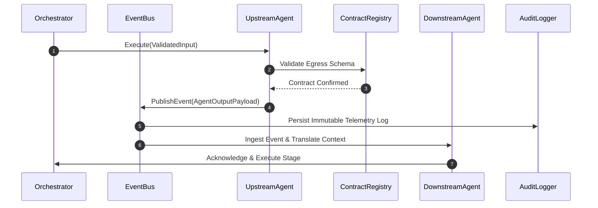

# Agent Communication & Event Flow

```mermaid
sequenceDiagram
    autonumber
    participant Orchestrator
    participant EventBus
    participant UpstreamAgent
    participant ContractRegistry
    participant DownstreamAgent
    participant AuditLogger

    Orchestrator->>UpstreamAgent: Execute(ValidatedInput)
    UpstreamAgent->>ContractRegistry: Validate Egress Schema
    ContractRegistry-->>UpstreamAgent: Contract Confirmed
    UpstreamAgent->>EventBus: PublishEvent(AgentOutputPayload)
    EventBus->>AuditLogger: Persist Immutable Telemetry Log
    EventBus->>DownstreamAgent: Ingest Event & Translate Context
    DownstreamAgent->>Orchestrator: Acknowledge & Execute Stage
```
