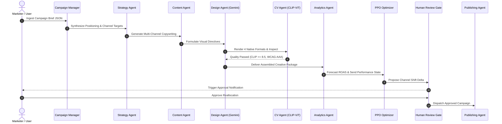

# End-to-End Agent Pipeline Diagram

```mermaid
sequenceDiagram
    autonumber
    actor User as Marketer / User
    participant CM as Campaign Manager
    participant Strat as Strategy Agent
    participant Content as Content Agent
    participant Design as Design Agent (Gemini)
    participant CV as CV Agent (CLIP-ViT)
    participant Analytics as Analytics Agent
    participant PPO as PPO Optimizer
    participant HITL as Human Review Gate
    participant Pub as Publishing Agent

    User->>CM: Ingest Campaign Brief JSON
    CM->>Strat: Synthesize Positioning & Channel Targets
    Strat->>Content: Generate Multi-Channel Copywriting
    Content->>Design: Formulate Visual Directives
    Design->>CV: Render 4 Native Formats & Inspect
    CV-->>Design: Quality Passed (CLIP >= 8.5, WCAG AAA)
    Design->>Analytics: Deliver Assembled Creative Package
    Analytics->>PPO: Forecast ROAS & Send Performance State
    PPO->>HITL: Propose Channel Shift Delta
    HITL-->>User: Trigger Approval Notification
    User->>HITL: Approve Reallocation
    HITL->>Pub: Dispatch Approved Campaign
```
