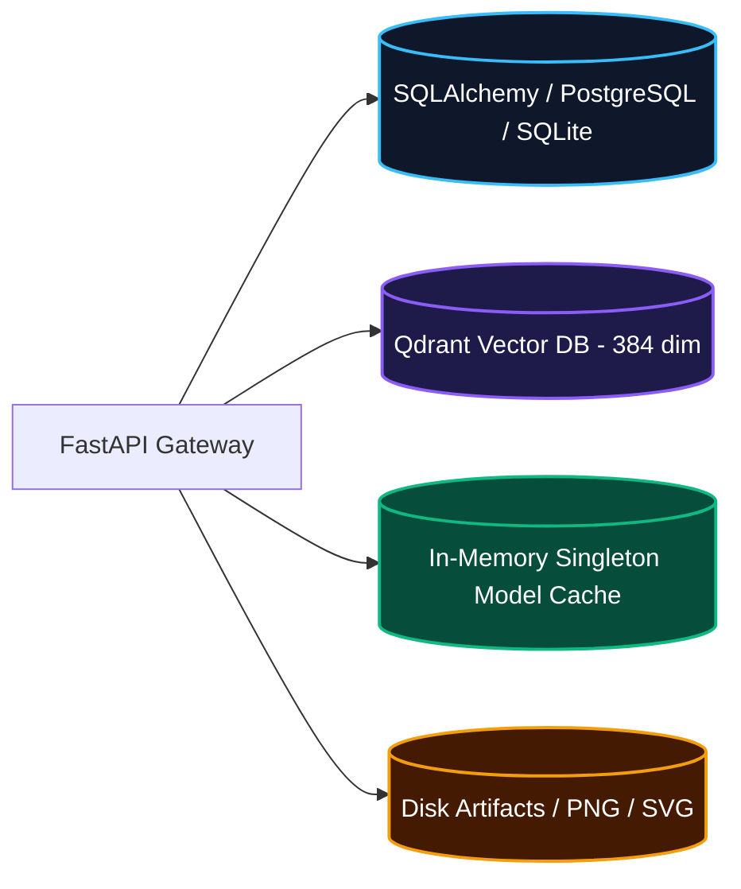

# Data & Storage Layer Architecture

```mermaid
graph LR
    classDef sql fill:#0f172a,stroke:#38bdf8,stroke-width:2px,color:#fff;
    classDef vec fill:#1e1b4b,stroke:#8b5cf6,stroke-width:2px,color:#fff;
    classDef cache fill:#064e3b,stroke:#10b981,stroke-width:2px,color:#fff;
    classDef file fill:#451a03,stroke:#f59e0b,stroke-width:2px,color:#fff;

    API[FastAPI Gateway] --> SQL[(SQLAlchemy / PostgreSQL / SQLite)]:::sql
    API --> VEC[(Qdrant Vector DB - 384 dim)]:::vec
    API --> CACHE[(In-Memory Singleton Model Cache)]:::cache
    API --> FILES[(Disk Artifacts / PNG / SVG)]:::file
```
