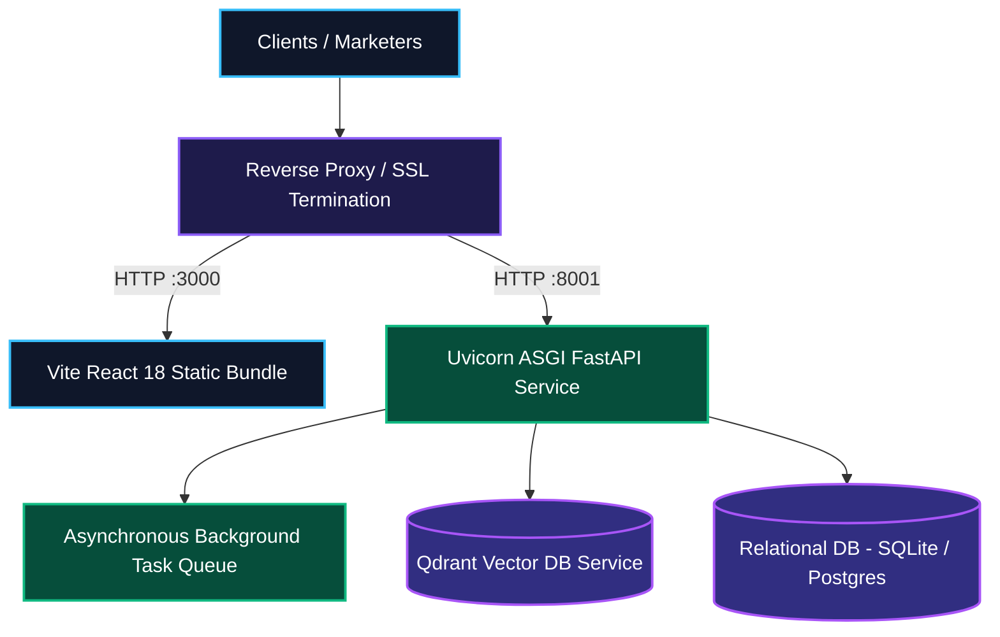

# Enterprise Production Deployment Architecture

```mermaid
graph TD
    classDef client fill:#0f172a,stroke:#38bdf8,stroke-width:2px,color:#fff;
    classDef proxy fill:#1e1b4b,stroke:#8b5cf6,stroke-width:2px,color:#fff;
    classDef app fill:#064e3b,stroke:#10b981,stroke-width:2px,color:#fff;
    classDef data fill:#312e81,stroke:#a855f7,stroke-width:2px,color:#fff;

    INTERNET[Clients / Marketers]:::client --> NGINX[Reverse Proxy / SSL Termination]:::proxy
    NGINX -->|HTTP :3000| VITE[Vite React 18 Static Bundle]:::client
    NGINX -->|HTTP :8001| FASTAPI[Uvicorn ASGI FastAPI Service]:::app
    
    FASTAPI --> WORKER[Asynchronous Background Task Queue]:::app
    FASTAPI --> QDRANT[(Qdrant Vector DB Service)]:::data
    FASTAPI --> DB[(Relational DB - SQLite / Postgres)]:::data
```
