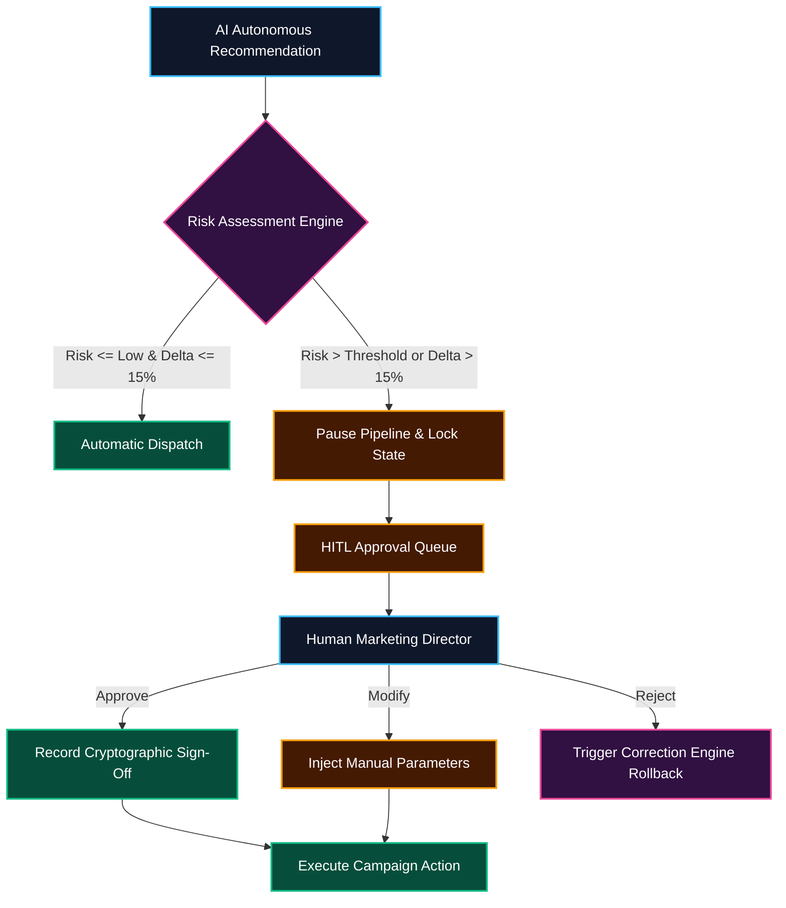

# Human-in-the-Loop Architecture Diagram

```mermaid
graph TD
    classDef rec fill:#0f172a,stroke:#38bdf8,stroke-width:2px,color:#fff;
    classDef gate fill:#311042,stroke:#ec4899,stroke-width:2px,color:#fff;
    classDef action fill:#064e3b,stroke:#10b981,stroke-width:2px,color:#fff;
    classDef rev fill:#451a03,stroke:#f59e0b,stroke-width:2px,color:#fff;

    AI[AI Autonomous Recommendation]:::rec --> CHK{Risk Assessment Engine}:::gate
    CHK -->|Risk <= Low & Delta <= 15%| AUTO[Automatic Dispatch]:::action
    CHK -->|Risk > Threshold or Delta > 15%| PAUSE[Pause Pipeline & Lock State]:::rev
    
    PAUSE --> QUEUE[HITL Approval Queue]:::rev
    QUEUE --> HUMAN[Human Marketing Director]:::rec
    
    HUMAN -->|Approve| APPROVE[Record Cryptographic Sign-Off]:::action
    APPROVE --> DISPATCH[Execute Campaign Action]:::action
    
    HUMAN -->|Modify| MOD[Inject Manual Parameters]:::rev
    MOD --> DISPATCH
    
    HUMAN -->|Reject| REJ[Trigger Correction Engine Rollback]:::gate
```
