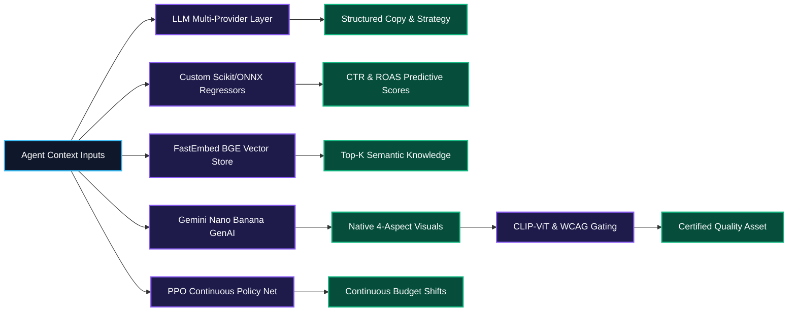

# Multi-Modal ML, RL & Vision Architecture

```mermaid
graph LR
    classDef input fill:#0f172a,stroke:#38bdf8,stroke-width:2px,color:#fff;
    classDef model fill:#1e1b4b,stroke:#8b5cf6,stroke-width:2px,color:#fff;
    classDef out fill:#064e3b,stroke:#10b981,stroke-width:2px,color:#fff;

    IN[Agent Context Inputs]:::input --> M1[LLM Multi-Provider Layer]:::model
    IN --> M2[Custom Scikit/ONNX Regressors]:::model
    IN --> M3[FastEmbed BGE Vector Store]:::model
    IN --> M4[Gemini Nano Banana GenAI]:::model
    IN --> M5[PPO Continuous Policy Net]:::model
    
    M1 --> OUT1[Structured Copy & Strategy]:::out
    M2 --> OUT2[CTR & ROAS Predictive Scores]:::out
    M3 --> OUT3[Top-K Semantic Knowledge]:::out
    M4 --> OUT4[Native 4-Aspect Visuals]:::out
    M5 --> OUT5[Continuous Budget Shifts]:::out
    
    OUT4 --> CV[CLIP-ViT & WCAG Gating]:::model
    CV --> OUT6[Certified Quality Asset]:::out
```
