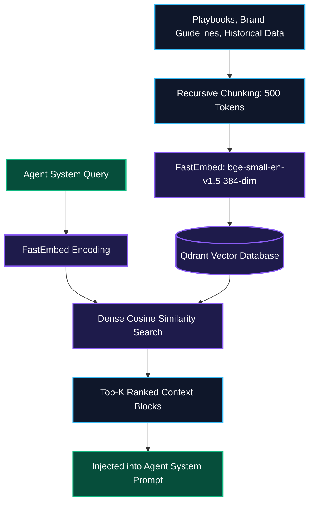

# RAG & Semantic Memory Retrieval Flow

```mermaid
graph TD
    classDef doc fill:#0f172a,stroke:#38bdf8,stroke-width:2px,color:#fff;
    classDef vector fill:#1e1b4b,stroke:#8b5cf6,stroke-width:2px,color:#fff;
    classDef agent fill:#064e3b,stroke:#10b981,stroke-width:2px,color:#fff;

    DOC[Playbooks, Brand Guidelines, Historical Data]:::doc --> CHUNK[Recursive Chunking: 500 Tokens]:::doc
    CHUNK --> EMB[FastEmbed: bge-small-en-v1.5 384-dim]:::vector
    EMB --> QDRANT[(Qdrant Vector Database)]:::vector
    
    QUERY[Agent System Query]:::agent --> Q_EMB[FastEmbed Encoding]:::vector
    Q_EMB --> SEARCH[Dense Cosine Similarity Search]:::vector
    QDRANT --> SEARCH
    SEARCH --> TOPK[Top-K Ranked Context Blocks]:::doc
    TOPK --> PROMPT[Injected into Agent System Prompt]:::agent
```
