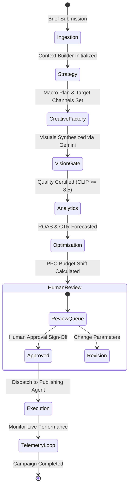

# End-to-End Campaign Simulation Lifecycle

```mermaid
stateDiagram-v2
    [*] --> Ingestion: Brief Submission
    Ingestion --> Strategy: Context Builder Initialized
    Strategy --> CreativeFactory: Macro Plan & Target Channels Set
    CreativeFactory --> VisionGate: Visuals Synthesized via Gemini
    VisionGate --> Analytics: Quality Certified (CLIP >= 8.5)
    Analytics --> Optimization: ROAS & CTR Forecasted
    Optimization --> HumanReview: PPO Budget Shift Calculated
    
    state HumanReview {
        [*] --> ReviewQueue
        ReviewQueue --> Approved: Human Approval Sign-Off
        ReviewQueue --> Revision: Change Parameters
    }
    
    Approved --> Execution: Dispatch to Publishing Agent
    Execution --> TelemetryLoop: Monitor Live Performance
    TelemetryLoop --> [*]: Campaign Completed
```
