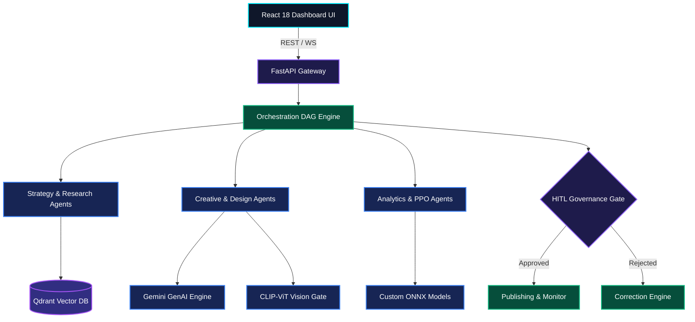

# System Architecture Diagram

```mermaid
graph TD
    classDef client fill:#0f172a,stroke:#00f0ff,stroke-width:2px,color:#fff;
    classDef gateway fill:#1e1b4b,stroke:#8b5cf6,stroke-width:2px,color:#fff;
    classDef engine fill:#064e3b,stroke:#10b981,stroke-width:2px,color:#fff;
    classDef agent fill:#172554,stroke:#3b82f6,stroke-width:2px,color:#fff;
    classDef storage fill:#312e81,stroke:#a855f7,stroke-width:2px,color:#fff;

    UI[React 18 Dashboard UI]:::client -->|REST / WS| API[FastAPI Gateway]:::gateway
    API --> ORCH[Orchestration DAG Engine]:::engine
    
    ORCH --> AG1[Strategy & Research Agents]:::agent
    ORCH --> AG2[Creative & Design Agents]:::agent
    ORCH --> AG3[Analytics & PPO Agents]:::agent
    
    AG1 --> RAG[(Qdrant Vector DB)]:::storage
    AG2 --> GEMINI[Gemini GenAI Engine]:::agent
    AG2 --> CV[CLIP-ViT Vision Gate]:::agent
    AG3 --> ML[Custom ONNX Models]:::agent
    
    ORCH --> HITL{HITL Governance Gate}:::gateway
    HITL -->|Approved| PUB[Publishing & Monitor]:::engine
    HITL -->|Rejected| REV[Correction Engine]:::engine
```
