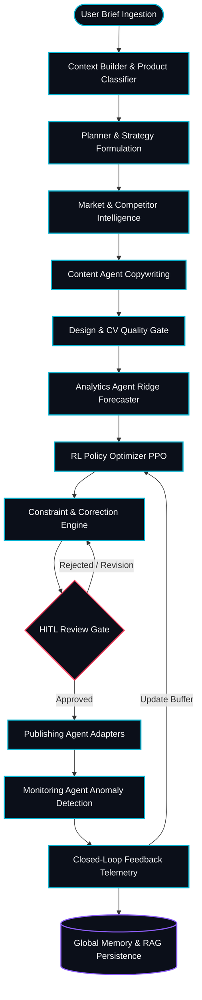

# ADPilot Pro — System Overview

**Status:** [IMPLEMENTED]  
**Version:** 2.0.0 Production Core  
**Author:** AI Systems Architecture & Research Documentation Team  

---

## 1. What is ADPilot Pro?

**ADPilot Pro** is an enterprise-grade autonomous AI marketing operating system. It ingests structured campaign briefs and executes an end-to-end, multi-model intelligence pipeline to produce launch-ready marketing campaigns across major ad platforms (Meta, Google Ads, LinkedIn, Email).

Unlike monolithic prompt-based systems, ADPilot Pro orchestrates **specialized, decoupled AI agents**, statistical and classical machine learning models, deep reinforcement learning (RL) policy optimizers, computer vision quality scorers, and dual-stream hybrid Retrieval-Augmented Generation (RAG) with cryptographic human-in-the-loop (HITL) approval gates.

---

## 2. ADPilot in 60 Seconds

> **The Problem:** Modern digital marketing demands complex cross-functional coordination: competitive research, audience psychographic segmentation, multi-channel copywriting, visual asset prompt engineering, financial forecasting, budget optimization, and compliance auditing. Traditional workflows are slow, fragmented, prone to human error, and disconnected from real-time performance feedback.
>
> **The Solution:** ADPilot Pro replaces disconnected toolchains with a deterministic, contract-governed AI Operating System. A user inputs a raw product brief; the system validates it, classifies the product vertical, derives execution roadmaps, drafts compliant copy, scores visual aesthetics via zero-shot computer vision, forecasts ROAS/CAC via classical ML, optimizes channel spend via continuous RL policy gradients, and presents high-risk actions to human reviewers with cryptographic audit logging.
>
> **The Outcome:** Comprehensive, multi-channel marketing campaigns generated in **under 45 seconds** with mathematically bound budget allocations, WCAG AAA compliant visual designs, and full audit provenance.

---

## 3. ADPilot in One Diagram

---

## 4. Key Capabilities & Architectural Pillars

| Capability | Technical Mechanism | Implementation Status |
|---|---|---|
| **Contract-Driven Pipeline** | Pydantic v2 schemas for all inputs/outputs with strict type enforcement | [IMPLEMENTED] |
| **Multi-Agent Orchestration** | Master orchestrator with dependency DAG and error retry cap | [IMPLEMENTED] |
| **Continuous RL Spend Optimizer** | PyTorch PPO neural network with Dirichlet budget projection | [IMPLEMENTED] |
| **Predictive ROI Modeling** | Multi-target Ridge regression forecasting ROAS, CAC, and CVR | [IMPLEMENTED] |
| **Zero-Shot Visual Governance** | ONNX CLIP-ViT B/32 aesthetic quality and WCAG contrast check | [IMPLEMENTED] |
| **Dual-Stream Hybrid RAG** | FastEmbed BGE dense vectors + BM25 Okapi with Reciprocal Rank Fusion | [IMPLEMENTED] |
| **Multi-Tier Memory Engine** | Working Memory, Brand Identity, Customer Personas, RL Trajectories | [IMPLEMENTED] |
| **Cryptographic Governance** | RBAC role switching with HMAC-SHA256 signed audit trails | [IMPLEMENTED] |
| **Executive Intelligence UI** | React 18 + TypeScript 5 + Vite glassmorphism AI Operating System | [IMPLEMENTED] |
| **Closed-Loop Monitoring** | Statistical Z-score anomaly detection and automated policy updates | [IMPLEMENTED] |

---

## 5. Target Users & Operating Scenarios

1. **Enterprise CMOs & Growth Leaders:** Real-time visibility into blended ROAS, autonomous spend decisions, and cross-channel financial attribution.
2. **Performance Marketers & Media Buyers:** Automated campaign drafting, continuous PPO budget rebalancing, and A/B test parameter formulation.
3. **Brand Compliance & Legal Auditors:** Deterministic review gates ensuring zero off-brand claims, strict contrast standards, and cryptographic signature tracking.

---

## 6. Implementation Status Matrix

- **Backend Core (`src/adpilot/`):** 100% Implemented (FastAPI, Master Orchestrator, RL, RAG, Memory, HITL, Publishing, Monitoring).
- **Machine Learning Layer (`research/models/`):** 100% Implemented (PyTorch PPO weights, Scikit-Learn Ridge models, CLIP-ViT ONNX, BGE embeddings).
- **Frontend Dashboard (`frontend/`):** 100% Implemented (29 modular React components, Executive Dashboard, DAG 2.0, Observatory, Studio).
- **Test Suites (`tests/` + `frontend/src/__tests__/`):** 269 / 269 Automated Tests Passing (217 Python backend, 52 Vitest frontend).
