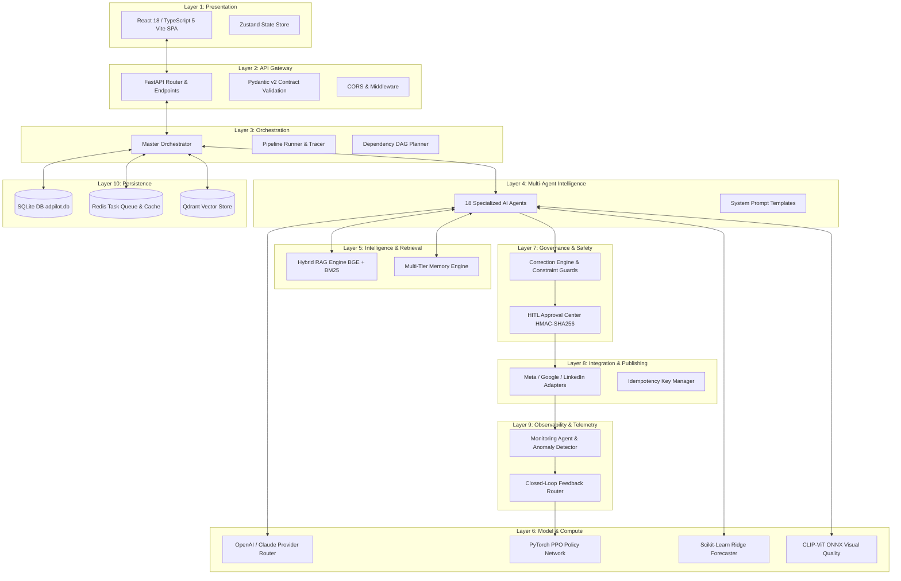

# ADPilot Pro — System Architecture

**Status:** [IMPLEMENTED]  
**Architecture Style:** Layered Multi-Agent Reactive Micro-Kernel  

---

## 1. Architectural Overview

ADPilot Pro is structured into **10 decoupled architectural layers**, designed for high throughput, strict contract safety, zero unhandled exceptions, and transparent observability.

---

## 2. Layer-by-Layer Detailed Breakdown

### Layer 1: Presentation Layer
- **Purpose:** Enterprise AI Operating System interface rendering real-time campaign progress, causal agent reasoning trees, financial attribution, and HITL governance gates.
- **Main Files:** `frontend/src/App.tsx`, `frontend/src/components/*` (29 components).
- **Core Technologies:** React 18, TypeScript 5, Vite, TailwindCSS v3, Zustand, Lucide-React.
- **Inputs:** User brief form inputs, approval actions, filter queries.
- **Outputs:** REST API calls (`GET`, `POST`) to backend endpoints.
- **Status:** [IMPLEMENTED]

### Layer 2: API Gateway Layer
- **Purpose:** Ingests external HTTP requests, applies CORS policies, validates request payloads against Pydantic schemas, and routes tasks to orchestrator instances.
- **Main Files:** `src/adpilot/api/main.py`, `src/adpilot/core/dependencies.py`.
- **Inputs:** JSON payloads from browser / CLI clients.
- **Outputs:** Typed JSON responses, task identifiers, streaming Server-Sent Events (SSE).
- **Status:** [IMPLEMENTED]

### Layer 3: Orchestration Layer
- **Purpose:** Enforces the immutable 18-stage execution order, manages stage state persistence, resolves dependencies, and records execution traces.
- **Main Files:** `src/adpilot/orchestrator/master_orchestrator.py`, `pipeline_runner.py`, `pipeline_tracer.py`, `planner.py`.
- **Inputs:** Validated `CampaignContext`.
- **Outputs:** Complete `CampaignTask` package and stage execution telemetry.
- **Status:** [IMPLEMENTED]

### Layer 4: Multi-Agent Layer
- **Purpose:** Autonomous domain-specific intelligence executing strategy, research, copywriting, design concepting, and visual auditing.
- **Main Files:** `src/adpilot/agents/*.py` (18 agents), `src/adpilot/core/base_agent.py`.
- **Inputs:** Upstream agent output schemas.
- **Outputs:** Downstream deterministic contracts.
- **Status:** [IMPLEMENTED]

### Layer 5: Intelligence, RAG & Memory Layer
- **Purpose:** Semantic search, document indexing, and 4-tier persistent memory to prevent hallucinations and maintain long-term brand consistency.
- **Main Files:** `src/adpilot/rag/*.py`, `src/adpilot/memory/*.py`.
- **Inputs:** User brief keywords, historical campaign metrics, brand guidelines.
- **Outputs:** Retrieved semantic chunks (MRR: 1.0), memory snapshots.
- **Status:** [IMPLEMENTED]

### Layer 6: Model & Compute Layer
- **Purpose:** Foundation LLM routing (GPT-4o, Claude 3.5 Sonnet), custom PyTorch PPO Actor-Critic neural policies, Scikit-Learn Ridge regressors, and CLIP-ViT ONNX vision models.
- **Main Files:** `src/adpilot/providers/*`, `src/adpilot/rl/*`, `research/models/*`.
- **Status:** [IMPLEMENTED]

### Layer 7: Governance & Safety Layer
- **Purpose:** Automatic constraint violation detection, rule remediation, and human-in-the-loop cryptographic signing for high-risk actions.
- **Main Files:** `src/adpilot/correction/*`, `src/adpilot/hitl/*`.
- **Status:** [IMPLEMENTED]

### Layer 8: Integration & Publishing Layer
- **Purpose:** Safe media dispatch to external ad networks (Meta Ads, Google Ads, LinkedIn, Email) with idempotency keys and mock sandbox fallbacks.
- **Main Files:** `src/adpilot/publishing/*`, `src/adpilot/publishing/adapters/*`.
- **Status:** [IMPLEMENTED]

### Layer 9: Observability & Closed-Loop Layer
- **Purpose:** Ingests live performance signals (impressions, clicks, conversions), computes anomaly Z-scores, and triggers automated RL policy updates.
- **Main Files:** `src/adpilot/monitoring/*`.
- **Status:** [IMPLEMENTED]

### Layer 10: Persistence Layer
- **Purpose:** Relational campaign data (SQLite), background queue and transient cache (Redis), and vector embeddings (Qdrant).
- **Main Files:** `src/adpilot/core/database.py`, `redis.py`, `src/adpilot/services/qdrant_store.py`.
- **Status:** [IMPLEMENTED]
