# ADPilot Pro — Complete End-to-End Pipeline

**Status:** [IMPLEMENTED]  
**Pipeline Contract:** Frozen Master Pipeline (18 Sequential Stages)  

---

## 1. End-to-End Pipeline Flowchart

```mermaid
sequenceDiagram
    autonumber
    actor User as User / Marketer
    participant API as FastAPI Gateway
    participant Orch as Master Orchestrator
    participant Agents as Agent Fleet (1-10)
    participant ML as ML & RL Models
    participant HITL as HITL Approval Center
    participant Pub as Publishing Agent
    participant Mon as Monitoring & Feedback

    User->>API: Submit Campaign Brief (JSON)
    API->>Orch: Initialize PipelineRunner(CampaignContext)
    
    rect rgb(11, 15, 25)
        Note over Orch,Agents: Phase 1: Planning & Strategy
        Orch->>Agents: Stage 2: Product Classifier (GPT-4o)
        Agents-->>Orch: ProductClassification (SaaS/Goods/RE/Service)
        Orch->>Agents: Stage 3: Planner Agent (Execution Plan DAG)
        Agents-->>Orch: ExecutionPlan
        Orch->>Agents: Stage 4: Strategy Agent (Positioning & Funnels)
        Agents-->>Orch: StrategyAgentOutput
    end

    rect rgb(11, 15, 25)
        Note over Orch,Agents: Phase 2: Research & Creative Creation
        Orch->>Agents: Stage 5: Research Agent (Claude 3.5 Sonnet)
        Agents-->>Orch: ResearchAgentOutput
        Orch->>Agents: Stage 6: Competitor Agent (Moat Matrix)
        Agents-->>Orch: CompetitorOutput
        Orch->>Agents: Stage 7: Content Agent (Copywriting)
        Agents-->>Orch: ContentAgentOutput
        Orch->>Agents: Stage 8: Design Agent (Image Prompts)
        Agents-->>Orch: DesignAgentOutput
    end

    rect rgb(11, 15, 25)
        Note over Orch,ML: Phase 3: ML Evaluation & RL Optimization
        Orch->>ML: Stage 9: CV Agent (CLIP-ViT ONNX Scoring)
        ML-->>Orch: CVScoreOutput (Aesthetic >= 7.0)
        Orch->>ML: Stage 10: Analytics Agent (Ridge ROI Forecaster)
        ML-->>Orch: AnalyticsAgentOutput (ROAS / CAC)
        Orch->>ML: Stage 11: RL Policy Optimizer (PPO Neural Policy)
        ML-->>Orch: OptimizationOutput (Dirichlet Spend Vector)
        Orch->>Agents: Stage 12: Correction Engine (Constraint Guards)
        Agents-->>Orch: CorrectionOutput (Violations Resolved)
    end

    rect rgb(11, 15, 25)
        Note over Orch,HITL: Phase 4: Governance & Live Dispatch
        Orch->>HITL: Stage 13: HITL Review Gate (Quarantine)
        HITL->>User: Request Cryptographic Authorization
        User-->>HITL: Sign Decision (HMAC-SHA256)
        HITL-->>Orch: HITLDecisionRecord (APPROVED)
        Orch->>Pub: Stage 14: Publishing Agent (Ad Adapters)
        Pub-->>Orch: PublishingResult (Dispatched)
    end

    rect rgb(11, 15, 25)
        Note over Orch,Mon: Phase 5: Monitoring & Closed-Loop Memory
        Orch->>Mon: Stage 15: Monitoring Agent (Anomaly Telemetry)
        Mon-->>Orch: MonitoringEvent (Z-Score Checks)
        Orch->>Mon: Stage 16: Feedback Engine (Signal Routing)
        Mon-->>ML: Update RL Trajectory Buffer
        Orch->>Mon: Stage 17-18: Global RAG & Memory Persistence
    end

    Orch-->>API: Campaign Pipeline Complete (100%)
    API-->>User: Complete Launch Package & Analytics
```

---

## 2. Comprehensive Stage-by-Stage Breakdown

### Stage 01: User Input Ingestion
- **Action:** User submits campaign brief via the React form or `/api/campaigns` REST endpoint.
- **Contract:** `CampaignInputSchema` validated by FastAPI and Pydantic v2.
- **Status:** [IMPLEMENTED]

### Stage 02: Campaign Context Builder
- **Action:** Normalizes unstructured goals, budget strings, and platform targets into a standardized `CampaignContext` entity.
- **File:** `src/adpilot/core/context_builder.py`.
- **Status:** [IMPLEMENTED]

### Stage 03: Product Classifier Agent
- **Action:** Evaluates product descriptions against taxonomy embeddings and classifies vertical (`B2B_SAAS`, `PHYSICAL_PRODUCT`, `REAL_ESTATE`, `SERVICE`).
- **Model:** GPT-4o Router.
- **Status:** [IMPLEMENTED]

### Stage 04: Execution Planner Agent
- **Action:** Generates the milestone graph, dependency order, and execution timelines.
- **Model:** GPT-4o Router.
- **Status:** [IMPLEMENTED]

### Stage 05: Strategy Formulation Agent
- **Action:** Selects primary advertising channels, defines value proposition angles, and outlines marketing funnel tiers.
- **Model:** GPT-4o Router.
- **Status:** [IMPLEMENTED]

### Stage 06: Market Research Agent
- **Action:** Synthesizes ICP demographics, psychographics, pain points, and current industry tailwinds.
- **Model:** Claude 3.5 Sonnet.
- **Status:** [IMPLEMENTED]

### Stage 07: Competitor Intelligence Agent
- **Action:** Profiles top market rivals, constructs competitive moats, and extracts differentiation hooks.
- **Model:** GPT-4o Router.
- **Status:** [IMPLEMENTED]

### Stage 08: Content Copywriting Agent
- **Action:** Generates multi-platform ad variations, headlines, CTAs, email sequences, and social media posts.
- **Model:** Claude 3.5 Sonnet.
- **Status:** [IMPLEMENTED]

### Stage 09: Creative Design Agent
- **Action:** Formulates art direction, color palettes, visual concept framing, and precise text-to-image prompts.
- **Model:** GPT-4o Router.
- **Status:** [IMPLEMENTED]

### Stage 10: Computer Vision (CV) Quality Agent
- **Action:** Evaluates visual compositions with CLIP-ViT B/32 zero-shot aesthetic regression and WCAG AAA contrast ratio calculation.
- **Model:** CLIP-ViT (ONNX).
- **Status:** [IMPLEMENTED]

### Stage 11: Analytics & Financial Forecaster Agent
- **Action:** Multi-target regression predicting blended ROAS, customer acquisition cost (CAC), and click-through rates (CTR).
- **Model:** Scikit-Learn Ridge Regressor (`research/models/analytics/`).
- **Status:** [IMPLEMENTED]

### Stage 12: Reinforcement Learning (RL) Policy Optimizer
- **Action:** Evaluates multi-channel return distributions and computes continuous Dirichlet budget reallocations.
- **Model:** PyTorch PPO Policy (`research/models/optimizer/ppo_policy.pt`).
- **Status:** [IMPLEMENTED]

### Stage 13: Correction Engine & Constraint Guard
- **Action:** Validates budget limits ($\le \text{MaxBudget}$), channel minimums ($\ge 5\%$), and brand tone compliance. Remediates violations autonomously.
- **File:** `src/adpilot/correction/engine.py`.
- **Status:** [IMPLEMENTED]

### Stage 14: Human-in-the-Loop (HITL) Review Gate
- **Action:** Enforces human authorization on high-risk actions. Emits an immutable HMAC-SHA256 signed audit receipt upon approval.
- **File:** `src/adpilot/hitl/gates.py`.
- **Status:** [IMPLEMENTED]

### Stage 15: Publishing Dispatch Agent
- **Action:** Transforms campaign assets into native ad platform formats and executes safe API dispatches (Meta Ads, Google Ads, LinkedIn).
- **File:** `src/adpilot/publishing/engine.py`.
- **Status:** [IMPLEMENTED]

### Stage 16: Monitoring & Anomaly Telemetry Agent
- **Action:** Ingests live performance signals and computes statistical Z-score anomalies against historical baselines.
- **File:** `src/adpilot/monitoring/telemetry.py`.
- **Status:** [IMPLEMENTED]

### Stage 17: Closed-Loop Feedback Engine
- **Action:** Converts live return deviations into experience tuples and appends them to the PPO reinforcement learning replay buffer.
- **File:** `src/adpilot/monitoring/closed_loop.py`.
- **Status:** [IMPLEMENTED]

### Stage 18: Global RAG & Memory Persistence
- **Action:** Indexes campaign outputs into Qdrant vector store and updates long-term brand identity and persona memory tiers.
- **File:** `src/adpilot/memory/manager.py`, `src/adpilot/rag/engine.py`.
- **Status:** [IMPLEMENTED]
