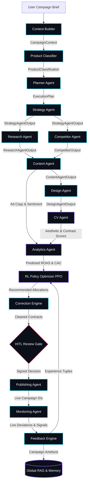

# Agent Interaction Map

**Status:** [IMPLEMENTED]  
**Communication Protocol:** Strictly Typed Pydantic v2 In-Memory Contracts  

---

## 1. Master Agent Communication Sequence

---

## 2. Interaction Contract Matrix

| Source Agent | Produced Contract | Target Consumer(s) | Transport Mechanism |
|---|---|---|---|
| **Context Builder** | `CampaignContext` | Product Classifier, Planner, Strategy | In-Memory Reference |
| **Product Classifier** | `ProductClassification` | Planner Agent, Strategy Agent | In-Memory Reference |
| **Planner Agent** | `ExecutionPlan` | Master Orchestrator, Strategy Agent | In-Memory Reference |
| **Strategy Agent** | `StrategyAgentOutput` | Research Agent, Competitor Agent, Content Agent | In-Memory Reference |
| **Research Agent** | `ResearchAgentOutput` | Competitor Agent, Audience Agent, Content Agent | In-Memory Reference |
| **Competitor Agent** | `CompetitorOutput` | Content Agent, Strategy Agent | In-Memory Reference |
| **Content Agent** | `ContentAgentOutput` | Design Agent, Analytics Agent, Publishing Agent | In-Memory Reference |
| **Design Agent** | `DesignAgentOutput` | CV Agent, Publishing Agent, Creative Studio | In-Memory Reference |
| **CV Agent** | `CVScoreOutput` | Analytics Agent, Correction Engine | In-Memory Reference |
| **Analytics Agent** | `AnalyticsAgentOutput` | RL Optimizer, Executive Dashboard | In-Memory Reference |
| **RL Optimizer** | `OptimizationOutput` | Correction Engine, HITL Gate, Publishing Agent | In-Memory Reference |
| **Correction Engine** | `CorrectionOutput` | HITL Gate, Master Orchestrator | In-Memory Reference |
| **HITL Gate** | `HITLDecisionRecord` | Publishing Agent, Audit Ledger | HMAC-SHA256 Signed Event |
| **Publishing Agent** | `PublishingResult` | Monitoring Agent, Executive Dashboard | Async REST HTTP |
| **Monitoring Agent** | `MonitoringEvent` | Feedback Engine, Live Activity Feed | Event Bus Stream |
| **Feedback Engine** | `PolicyBufferUpdate` | RL Policy Optimizer (PPO Buffer) | PyTorch Tensor Queue |
