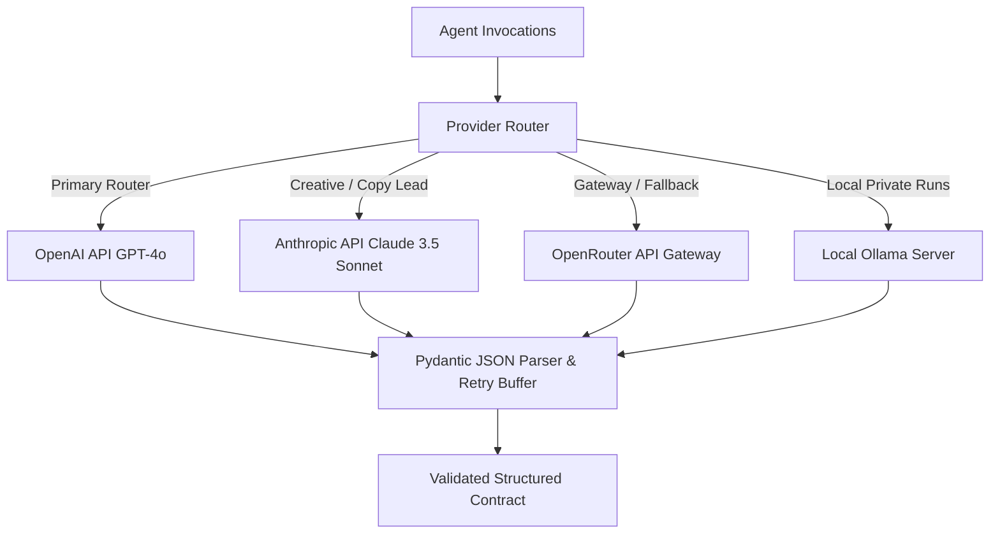

# LLM Layer

**Status:** [IMPLEMENTED]  
**Architecture:** Multi-Provider Dynamic Router with Structured Schema Enforcement  

---

## 1. Overview
The **LLM Layer** provides foundation model intelligence across strategic formulation, market research, competitor benchmarking, copywriting, and design prompt engineering. Rather than coupling agents to a single proprietary API, ADPilot utilizes a **Provider Router** (`src/adpilot/providers/factory.py`) supporting:
- OpenAI (`gpt-4o`, `gpt-4o-mini`)
- Anthropic Claude (`claude-3-5-sonnet-20241022`)
- OpenRouter Gateway (`google/gemini-2.5-pro`, open-source models)
- Local Ollama (`llama3.1`, `deepseek-r1`)

---

## 2. Provider Routing Architecture

---

## 3. Configuration & Model Assignments

| Agent | Primary Model | Provider | Temperature | Rationale |
|---|---|---|---|---|
| **Product Classifier** | `gpt-4o` | OpenAI | `0.1` | High classification accuracy across business taxonomies |
| **Planner Agent** | `gpt-4o` | OpenAI | `0.2` | Complex topological planning and dependency resolution |
| **Strategy Agent** | `gpt-4o` | OpenAI | `0.2` | Structured reasoning across marketing funnel tiers |
| **Research Agent** | `claude-3-5-sonnet-20241022` | Anthropic | `0.3` | Deep audience psychographic and pain point nuance |
| **Competitor Agent** | `gpt-4o` | OpenAI | `0.2` | Comparative feature matrix and moat formulation |
| **Content Agent** | `claude-3-5-sonnet-20241022` | Anthropic | `0.4` | High-converting, brand-authentic copywriting diversity |
| **Design Agent** | `gpt-4o` | OpenAI | `0.3` | Compositional hierarchy and text-to-image prompt synthesis |

---

## 4. Structured Output & Reliability Safeguards
1. **Pydantic Schema Injection:** Prompts include strict JSON schema specifications and format instructions.
2. **Deterministic Low Temperatures:** Set between `0.1` and `0.4` to minimize schema drift while preserving persuasive copy variance.
3. **Automatic Parse Retry:** If an LLM returns malformed JSON or markdown code block wrappers, `json_utils.py` cleans the response and re-attempts parsing up to 3 times before raising a typed exception.
