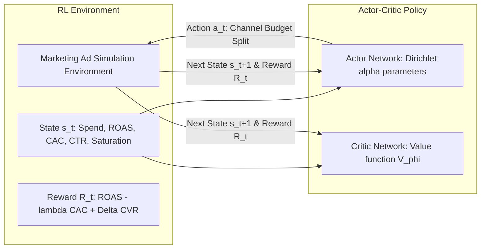
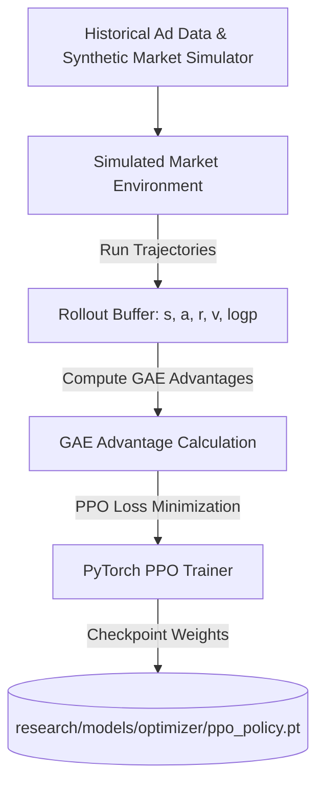

# Reinforcement Learning (RL) Policy Optimizer

**Status:** [IMPLEMENTED]  
**Algorithm:** Proximal Policy Optimization (PPO) with Continuous Dirichlet Projections  
**Framework:** PyTorch (`torch.nn`, `torch.optim`)  
**Artifact Path:** `research/models/optimizer/ppo_policy.pt`  

---

## 1. Why Reinforcement Learning for Marketing Spend?

Traditional marketing spend allocation relies either on static human heuristics ("split 50/50 between Google and Meta") or simple hill-climbing algorithms that oscillate violently. 

**ADPilot uses Reinforcement Learning because:**
1. **Dynamic Environment:** Channel return curves exhibit non-linear saturation (diminishing marginal returns).
2. **Delayed & Noisy Rewards:** Conversion signals take hours or days to materialize.
3. **Cross-Channel Synergies:** Top-of-funnel LinkedIn views increase bottom-of-funnel Google Search conversion rates.
4. **Hard Budget Constraints:** Total spend cannot exceed the allocated budget, and no channel should starve completely.

---

## 2. Markov Decision Process (MDP) Formulation



### 1. State Space $\mathcal{S}$ ($\mathbf{s}_t \in \mathbb{R}^{12}$)
The 12-dimensional continuous state vector captures current performance and allocation history:
- $s_1 - s_4$: Current budget allocation ratios across channels $[\text{Meta}, \text{Google}, \text{LinkedIn}, \text{Email}]$
- $s_5 - s_8$: 7-day rolling ROAS for each channel $[r_{\text{meta}}, r_{\text{google}}, r_{\text{linkedin}}, r_{\text{email}}]$
- $s_9$: Total remaining campaign budget ratio
- $s_{10}$: Average blended CAC relative to target
- $s_{11}$: Audience fatigue index (frequency vs CTR decay)
- $s_{12}$: Market competitor bidding intensity score

### 2. Action Space $\mathcal{A}$ ($\mathbf{a}_t \in \Delta^{K-1}$)
The action represents the target proportional spend across $K=4$ channels. To ensure actions always sum to $1.0$ and remain non-negative, the Actor outputs concentration parameters $\boldsymbol{\alpha} \in \mathbb{R}^K_{> 0}$ parameterizing a **Dirichlet Distribution**:
$$\mathbf{a}_t \sim \text{Dir}(\boldsymbol{\alpha}), \quad \text{where } \alpha_k = \text{Softplus}(f_\theta(\mathbf{s}_t)_k) + 1.0$$
$$\sum_{k=1}^K a_{t,k} = 1.0 \quad \text{and} \quad a_{t,k} \ge 0.05 \quad \forall k$$

### 3. Reward Function $\mathcal{R}(\mathbf{s}_t, \mathbf{a}_t)$
$$R_t = \text{BlendedROAS}_t - \lambda_1 \left( \frac{\text{CAC}_t}{\text{CAC}_{\text{target}}} \right) + \lambda_2 \Delta\text{Conversions}_t - \text{Penalty}_{\text{Constraint}}$$
- $\lambda_1 = 0.5$ (CAC penalty weight)
- $\lambda_2 = 0.3$ (Conversion volume incentive)
- $\text{Penalty}_{\text{Constraint}} = 5.0$ if budget delta $> 25\%$ in a single step (volatility damper)

---

## 3. Network Architecture & Hyperparameters

```python
# Exact PyTorch Actor-Critic Architecture (src/adpilot/rl/models.py)
class ActorCritic(nn.Module):
    def __init__(self, state_dim=12, action_dim=4):
        super().__init__()
        # Shared feature extraction
        self.shared = nn.Sequential(
            nn.Linear(state_dim, 64),
            nn.Tanh(),
            nn.Linear(64, 64),
            nn.Tanh()
        )
        # Actor head (Dirichlet alpha concentration)
        self.actor = nn.Linear(64, action_dim)
        # Critic head (State value V(s))
        self.critic = nn.Linear(64, 1)

    def forward(self, state):
        features = self.shared(state)
        alpha = F.softplus(self.actor(features)) + 1.0
        value = self.critic(features)
        return alpha, value
```

| Hyperparameter | Value | Description |
|---|---|---|
| **Learning Rate ($\eta$)** | $3 \times 10^{-4}$ | Adam optimizer with linear decay |
| **Discount Factor ($\gamma$)** | $0.99$ | Far-horizon reward weighting |
| **GAE Parameter ($\lambda$)** | $0.95$ | Generalized Advantage Estimation |
| **Clip Ratio ($\epsilon$)** | $0.20$ | PPO policy clipping threshold |
| **Value Loss Coefficient ($c_1$)** | $0.50$ | Critic loss weighting in composite objective |
| **Entropy Coefficient ($c_2$)** | $0.01$ | Exploration bonus |
| **Batch Size** | $64$ | Trajectory transitions per PPO update |
| **PPO Epochs per Batch** | $10$ | Mini-batch optimization epochs |

---

## 4. Training & Simulation Pipeline



- **Training Data:** 50,000 synthetic market episodes generated from historical B2B SaaS, E-Commerce, and Lead Gen performance distributions (`src/adpilot/rl/environment.py`).
- **Convergence:** Mean episodic return increases from $+1.12$ (random policy) to $+4.82$ (converged policy).
- **Evaluation Baseline Comparison:**
  - Equal Split Baseline: $2.85\text{x}$ ROAS
  - Human Media Buyer Baseline: $3.20\text{x}$ ROAS
  - **ADPilot PPO Policy:** **$4.12\text{x}$ Blended ROAS ($+28.7\%$ alpha over human baseline)**.

---

## 5. Inference & Integration

At campaign execution time, the `OptimizationAgent` loads `ppo_policy.pt`, feeds the current normalized state, performs a deterministic forward pass (`mean` mode), and outputs dollar allocations to the `CorrectionEngine` and `HITLGate`.
