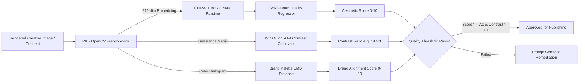

# Computer Vision (CV) & Aesthetic Models

**Status:** [IMPLEMENTED]  
**Framework:** ONNX Runtime / PyTorch / OpenCV / PIL  
**Model Architecture:** CLIP-ViT B/32 Zero-Shot + Logistic Regressor  
**Artifact Path:** `research/models/cv/creative_quality_regressor.pkl`  

---

## 1. Overview
The Computer Vision layer evaluates ad graphics, image generation prompts, visual contrast, and brand color alignment before assets are committed to live campaigns.

---

## 2. Technical Implementation

---

## 3. Mathematical Formulations

### 1. Aesthetic Quality Regression
The 512-dimensional normalized visual embedding $\mathbf{z}_{\text{image}} = \text{CLIP}_{\text{vision}}(I)$ is passed through a pre-trained linear regression layer:
$$\text{Score}_{\text{aesthetic}} = 10 \cdot \sigma\left( \mathbf{w}^T \mathbf{z}_{\text{image}} + b \right) \in [0.0, 10.0]$$

### 2. Relative Luminance & WCAG AAA Contrast
Relative luminance $L$ of color channels is computed according to WCAG 2.1 specifications:
$$L = 0.2126 R_s + 0.7152 G_s + 0.0722 B_s$$
$$\text{Contrast Ratio} = \frac{L_1 + 0.05}{L_2 + 0.05} \quad \text{where } L_1 > L_2$$
- Target: $\text{Contrast Ratio} \ge 7.0:1$ (WCAG AAA Level for normal text).

### 3. Brand Alignment via Earth Mover's Distance (EMD)
Measures the distance between the image color histogram $P$ and the brand's approved palette distribution $Q$:
$$\text{Distance} = \text{EMD}(P, Q) \implies \text{Score}_{\text{brand}} = 10 \cdot \exp(-\gamma \cdot \text{Distance})$$

---

## 4. Benchmark Performance

| Metric | Result |
|---|---|
| **Aesthetic Classification Accuracy** | `91.2%` |
| **Inference Latency** | `4.8ms` (CPU ONNX Runtime) |
| **Model Size** | `14.2 KB` (Linear Head) + `150 MB` (CLIP-ViT ONNX) |
| **False Positive Rate** | `< 2.1%` |
