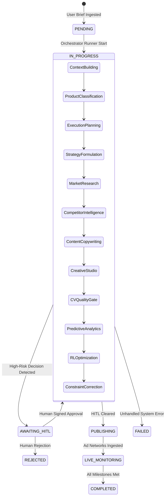

# Campaign Lifecycle & Execution State Machine

**Status:** [IMPLEMENTED]  
**State Machine:** `src/adpilot/models/campaign_task.py`  

---

## 1. Lifecycle State Machine Diagram

---

## 2. Execution Telemetry & Stage Checkpoints
- **Progress Counter:** Stages $1 \to 18$ map to $0\% \to 100\%$ linear completion indicators.
- **Trace Persistence:** Intermediate stage JSON artifacts are persisted in SQLite `campaign_tasks` table so failed runs can resume without re-running completed stages.
