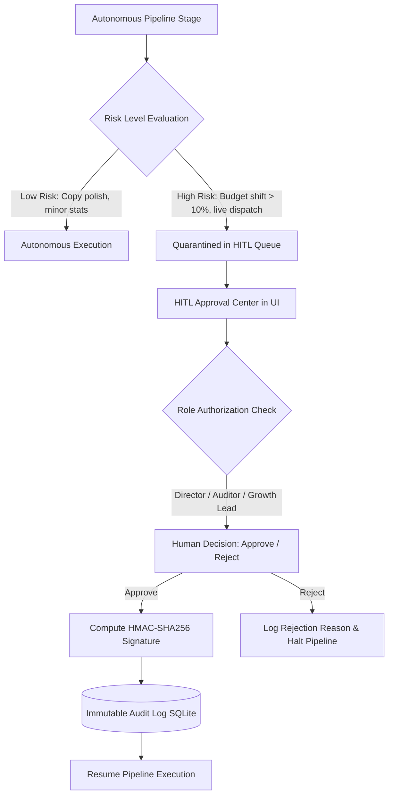

# Human-in-the-Loop (HITL) Governance Center

**Status:** [IMPLEMENTED]  
**Security Standard:** HMAC-SHA256 Cryptographically Signed Audit Ledger  
**Source Code:** `src/adpilot/hitl/`  

---

## 1. Governance Architecture & Quarantine Gates

---

## 2. Quarantined Decision Categories

| Category | Trigger Condition | Required Role | Risk Level |
|---|---|---|---|
| **Live Media Dispatch** | Activating external ad network billing | `Director` | `HIGH` |
| **PPO Budget Shift** | Rebalancing $> 10\%$ of total campaign budget | `Director` or `GrowthLead` | `MEDIUM` |
| **Brand Safety Exception** | Copy / design flagged near safety threshold | `ComplianceAuditor` | `HIGH` |
| **Contract Override** | Manual adjustment of Pydantic output schemas | `Director` | `CRITICAL` |

---

## 3. Cryptographic Signature Structure
$$\text{Signature} = \text{HMAC-SHA256}\left( K_{\text{private}}, \, \text{DecisionID} \,\|\, \text{CampaignID} \,\|\, \text{ReviewerRole} \,\|\, \text{Timestamp} \right)$$
- Every action receipt is permanently stamped with its signature hash (e.g., `SHA256-d7a8f9b2`) in `hitl_records`.
