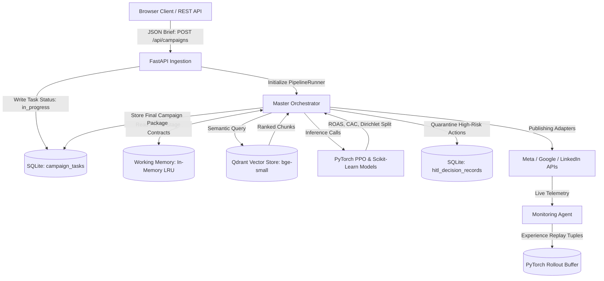

# Data Flow Architecture

**Status:** [IMPLEMENTED]  

---

## 1. End-to-End Data Flow Diagram

---

## 2. Data Flow Lifecycle

1. **Ingestion:** Raw input is validated and written as an active task in `adpilot.db`.
2. **Context Expansion:** RAG fetches relevant vectors from Qdrant; Brand memory loads style tokens from SQLite.
3. **Execution Pipeline:** Agent outputs pass through memory cache via typed Pydantic instances.
4. **Governance Locking:** If budget changes $> 10\%$, execution halts and writes a pending record to `hitl_decision_records`.
5. **Persistence & Export:** Completed campaigns are written to `campaign_tasks` and bundled into `data/outputs/` asset ZIP files.
