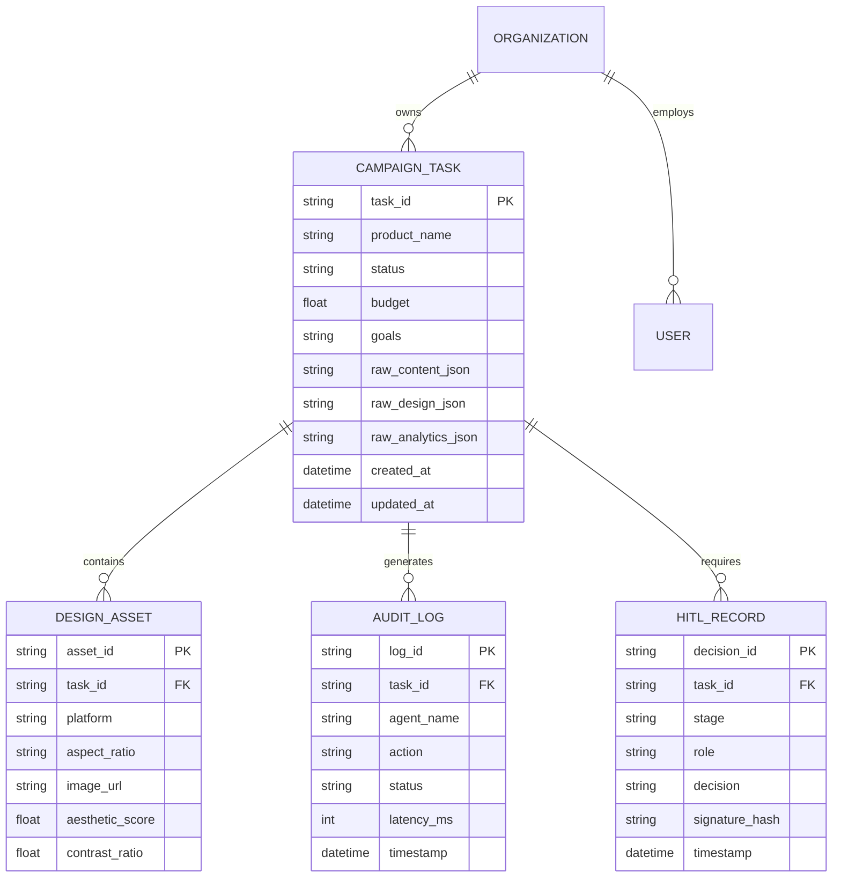

# Database Schema & Relational Models

**Status:** [IMPLEMENTED]  
**Database Engine:** SQLite (`data/adpilot.db`) / SQLAlchemy ORM / Pydantic v2  

---

## 1. Relational Entity Relationship (ER) Diagram

---

## 2. Table Specifications (`src/adpilot/models/`)

| Table Name | Model File | Purpose |
|---|---|---|
| `campaign_tasks` | `campaign_task.py` | Stores full campaign brief, execution status, and final JSON deliverables |
| `design_assets` | `design_asset.py` | Stores rendered creatives, aspect ratios, image URLs, and CV quality scores |
| `audit_logs` | `audit_log.py` | Immutable time-series log of all agent runs, latencies, and tool calls |
| `hitl_records` | `hitl/schemas.py` | Cryptographically signed human approval/rejection decisions |
| `organizations` | `organization.py` | Multi-tenant organization boundaries and brand rule settings |
| `users` | `user.py` | User authentication, RBAC roles (`Director`, `Auditor`, `GrowthLead`) |
