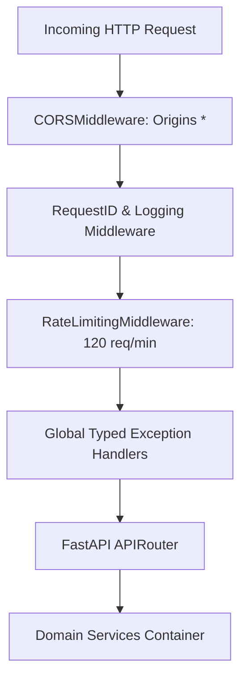

# Backend Architecture

**Status:** [IMPLEMENTED]  
**Framework:** FastAPI 0.110+ (Asynchronous Python 3.12)  
**Entry Point:** `src/adpilot/api/main.py`  

---

## 1. Overview
The **Backend Layer** provides high-throughput async REST endpoints, Server-Sent Events (SSE) streaming, task lifecycle management, database transactions via SQLAlchemy, and multi-provider LLM routing.

---

## 2. Server Architecture & Middleware Stack

---

## 3. Dependency Injection & Service Container (`src/adpilot/core/container.py`)
ADPilot uses a dependency injection pattern providing singleton and scoped services:
- `get_db()`: Scoped SQLAlchemy database session.
- `get_memory_service()`: Singleton MemoryService with Redis cache.
- `get_rag_service()`: Singleton Hybrid RAG retriever.
- `get_orchestrator()`: PipelineRunner instance bound to campaign context.
- `get_provider_router()`: Multi-LLM provider client.
