# Frontend Architecture & AI OS Client

**Status:** [IMPLEMENTED]  
**Framework:** React 18 / TypeScript 5 / Vite / TailwindCSS v3  
**Root Directory:** `frontend/`  

---

## 1. Overview
The frontend is an **AI Operating System Dashboard** designed with dark obsidian glassmorphism aesthetics. It provides visual explainability, real-time pipeline monitoring, causal tree inspection, and cryptographic governance control.

---

## 2. Component Hierarchy

```mermaid
graph TD
    App[App.tsx Master Container] --> TopBar[CampaignControlBar: Breadcrumbs, Simulation & Palette]
    App --> Sidebar[5-Tier OS Navigation Sidebar]
    
    App --> Views[Dynamic View Switcher]
    Views --> Exec[ExecutiveDashboardView: KPIs, Trajectory SVG, Attribution]
    Views --> DAG[InteractivePipelineDAG: 18-Node Adaptive Grid]
    Views --> Obs[AgentObservatory: Fleet Latency & Telemetry]
    Views --> HITL[HITLApprovalCenter: RBAC & HMAC-SHA256 Signing]
    Views --> Opt[OptimizerDashboard: PPO Loss Curves & Dirichlet Sliders]
    Views --> Mod[ModelRegistryView: Catalog & Benchmark Arena]
    Views --> Know[KnowledgeBaseView: RAG & 4-Tier Memory Engine]
    Views --> Studio[CreativeStudioView: Visual Cards & CLIP-ViT Scores]
    Views --> Time[CampaignTimelineView: Chronological Event Stream]
    Views --> Health[SystemHealthView: Platform Diagnostics]

    App --> Drawers[Modals & Slide-Overs]
    Drawers --> Detail[AgentDetailDrawer: 4-Stage Causal Reasoning Tree]
    Drawers --> IO[IOInspectorModal: Raw JSON Input/Output Payloads]
    Drawers --> Demo[InteractiveDemoModal: 18-Stage Animated Walkthrough]
```

---

## 3. State Management & API Integration
- **Global Store (`src/store/useAppStore.ts`):** Zustand store managing active campaign state, theme (Dark/Light), active OS navigation section, and live activity stream events.
- **API Client (`src/services/api.ts`):** Axios client with dynamic environment resolution (`/api` proxy in browser sessions, `http://127.0.0.1:8000/api` in Vitest mock sessions).
- **Task Poller (`src/hooks/useTaskPolling.ts`):** Adaptive 2-second polling hook syncing live pipeline execution status and intermediate outputs.
