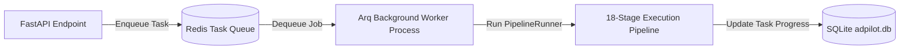

# Background Workers & Task Queues

**Status:** [IMPLEMENTED]  
**Technology:** Redis Task Queue / `arq` Asynchronous Worker / Python `asyncio`  

---

## 1. Overview
Long-running multi-agent pipelines and ML inference tasks can be executed asynchronously in the background via Redis-backed workers, preventing web server worker blocking during heavy LLM generation.

---

## 2. Worker Architecture (`src/adpilot/worker.py`)



---

## 3. Worker Settings & Lifecycle
- **Worker Configuration:** `adpilot.worker.WorkerSettings`
- **Redis Queue Key:** `arq:queue`
- **Job Timeout:** `300 seconds` (5 minutes maximum per campaign run)
- **Max Jobs:** `10 concurrent pipelines per worker instance`
- **Execution Command:**
  ```powershell
  $env:PYTHONPATH="src"
  arq adpilot.worker.WorkerSettings
  ```
