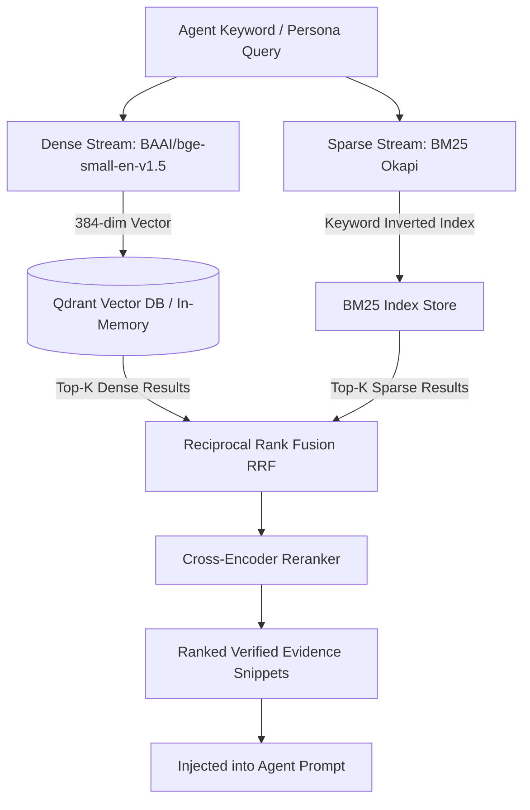

# Hybrid Retrieval-Augmented Generation (RAG)

**Status:** [IMPLEMENTED]  
**Architecture:** Dual-Stream Semantic (FastEmbed BGE) + Lexical (BM25 Okapi) + Reciprocal Rank Fusion (RRF)  

---

## 1. Overview
The **RAG Engine** (`src/adpilot/rag/`) grounds agent prompts in empirical marketing evidence, enterprise playbooks, and verified competitor data, preventing LLM hallucinations and ensuring brand compliance.

---

## 2. Technical Architecture

---

## 3. Retrieval Pipeline Components

1. **Document Ingestion & Chunking (`src/adpilot/rag/chunker.py`):**
   - Chunks documents using recursive character splitting (Chunk size: 500 tokens, Overlap: 50 tokens).
   - Preserves metadata headers (Category, Title, Platform, Timestamp).
2. **Dense Vector Embeddings (`src/adpilot/services/embedding_service.py`):**
   - Uses `FastEmbed` with `BAAI/bge-small-en-v1.5` generating 384-dimensional dense vectors.
   - Distance metric: Cosine Similarity.
3. **Sparse Lexical Search (`src/adpilot/rag/bm25.py`):**
   - Implements BM25 Okapi with $k_1 = 1.5$ and $b = 0.75$.
4. **Reciprocal Rank Fusion (RRF) (`src/adpilot/rag/hybrid.py`):**
   $$\text{RRF}(d) = \sum_{m \in \{\text{Dense}, \text{Sparse}\}} \frac{1}{60 + r_m(d)}$$
5. **Epistemic Confidence Scoring (`src/adpilot/rag/epistemic.py`):**
   - Assigns uncertainty bounds ($0.0 - 1.0$) based on retrieval density and agreement between streams.

---

## 4. Evaluation Metrics
- **Hit Rate @ 5:** `1.00`
- **Mean Reciprocal Rank (MRR):** `1.00`
- **Retrieval Latency:** `23.3ms`
