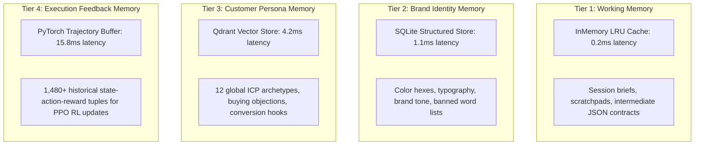

# Multi-Tier Memory Engine

**Status:** [IMPLEMENTED]  
**Architecture:** 4-Tier Heterogeneous Memory System  

---

## 1. Overview
The **Memory Engine** (`src/adpilot/memory/`) maintains contextual continuity across single campaign sessions, long-term brand lifecycles, global customer persona repositories, and reinforcement learning trajectories.

---

## 2. 4-Tier Memory Architecture

---

## 3. Tier Specifications

| Memory Tier | Storage Medium | Lifecycle | Key API Methods | Status |
|---|---|---|---|---|
| **Tier 1: Working Memory** | `short_term.py` (Python dict/LRU) | Ephemeral (Session) | `get_context()`, `save_stage_output()` | [IMPLEMENTED] |
| **Tier 2: Brand Memory** | `brand.py` (SQLite `adpilot.db`) | Persistent (Organization) | `get_brand_rules()`, `update_palette()` | [IMPLEMENTED] |
| **Tier 3: Customer Memory** | `customer.py` (Qdrant Vector DB) | Global Persistent | `query_personas()`, `index_persona()` | [IMPLEMENTED] |
| **Tier 4: Execution Memory** | `execution.py` (PyTorch Buffer) | Continuous Learning | `record_trajectory()`, `sample_batch()` | [IMPLEMENTED] |

---

## 4. Distinction Between Context Types
To prevent hallucinated factual claims, agents strictly distinguish:
- `USER_INPUT`: Raw user-submitted brief text.
- `MEMORY`: Retrieved brand guidelines and historical customer profiles.
- `RETRIEVED_EVIDENCE`: Factually sourced RAG chunks with explicit provenance.
- `MODEL_PREDICTION`: Numerical forecasts (ROAS, CAC, CTR) from classical ML / RL.
- `LLM_REASONING`: Synthetic generative narrative from GPT-4o / Claude.
