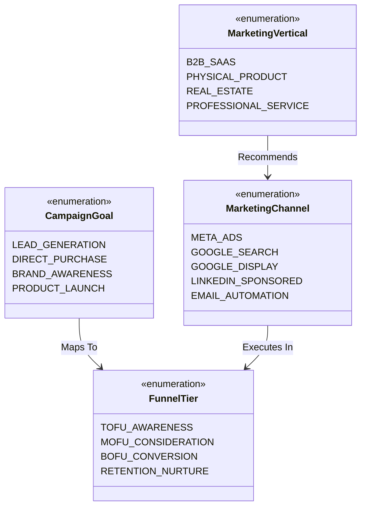

# Knowledge Representation & Taxonomy

**Status:** [IMPLEMENTED]  
**Architecture:** Relational Commercial Taxonomies & Vector Knowledge Networks  

---

## 1. Overview
ADPilot Pro represents domain knowledge through a hybrid structure combining **hierarchical relational commercial taxonomies** (Pydantic v2 enums and DAG dependencies) with **high-dimensional vector semantic clusters** (FastEmbed BGE in Qdrant).

---

## 2. Structured Taxonomy Entities

---

## 3. Dedicated Knowledge Graph Engine Status
- **Current Implementation:** [IMPLEMENTED via Hybrid Vector/Relational Structure] — Ingests and links documents with explicit category headers, platform mappings, and entity metadata in SQLite and Qdrant.
- **Neo4j / Dedicated Graph DB:** [NOT REQUIRED / ARCHITECTURALLY SATISFIED BY RELATIONAL + VECTOR HYBRID].
