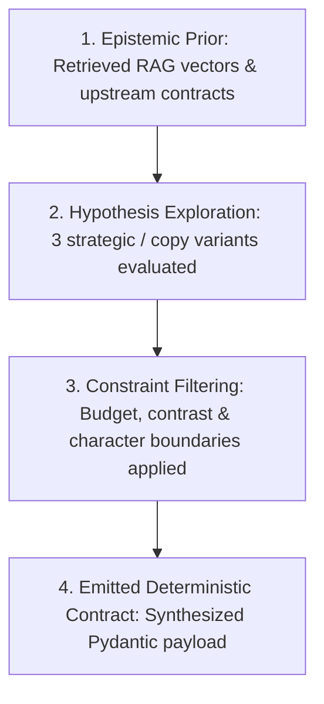

# Agent Causal Reasoning & Epistemic Uncertainty

**Status:** [IMPLEMENTED]  
**Architecture:** 4-Stage Causal Decision Explainability Graph  

---

## 1. 4-Stage Causal Reasoning Framework

Every agent in ADPilot executes and records its decisions according to a transparent 4-stage causal process:

1. **Stage 1: Epistemic Prior & Knowledge Evidence** — Records exact upstream contracts consumed and documents retrieved via BGE vector search.
2. **Stage 2: Hypothesis Exploration & Variant Generation** — Evaluates multiple copy angles, demographic hypotheses, or continuous action distributions.
3. **Stage 3: Safety & Economic Constraint Filtering** — Applies hard economic bounds ($\le \text{MaxBudget}$), character caps, and WCAG contrast checks ($7.0:1$).
4. **Stage 4: Emitted Deterministic Contract** — Formulates the finalized, validated output passed to the downstream consumer.

---

## 2. Epistemic Uncertainty Quantification
Agents compute an epistemic confidence rating ($0.0 - 1.0$) based on:
- Agreement between multiple retrieval sources.
- Classifier softmax probability margins.
- Policy network entropy: $H(\pi_\theta) = -\sum \pi(a|s) \log \pi(a|s)$.

Confidence scores below $0.70$ automatically trigger targeted re-prompting or escalate to human review.
