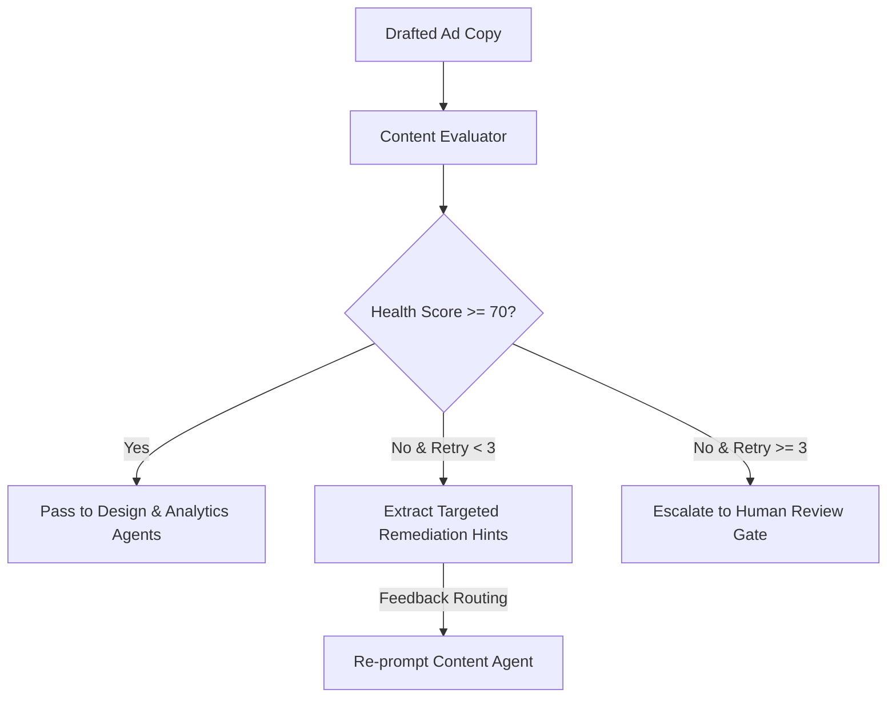

# Intelligence & Output Quality Evaluation

**Status:** [IMPLEMENTED]  
**Component:** `ContentEvaluator` & Automated Quality Gates  

---

## 1. Overview
ADPilot Pro employs continuous automated evaluation during campaign generation. The `ContentEvaluator` (`src/adpilot/agents/content_evaluator.py`) inspects drafted copy against a multi-factor rubric before downstream design or budget allocation occurs.

---

## 2. Evaluation Rubric & Scoring Weights

$$\text{Composite Health Score} = 0.30 S_{\text{alignment}} + 0.25 S_{\text{brand}} + 0.20 S_{\text{urgency}} + 0.15 S_{\text{readability}} + 0.10 S_{\text{formatting}}$$

| Dimension | Evaluation Method | Threshold |
|---|---|---|
| **Strategy Alignment ($S_{\text{alignment}}$)** | Semantic similarity with `StrategyAgentOutput` | $\ge 0.75$ |
| **Brand Voice ($S_{\text{brand}}$)** | Scikit-Learn `brand_voice_classifier.pkl` | $\ge 0.80$ |
| **Urgency & CTA ($S_{\text{urgency}}$)** | Keyword density of actionable conversion verbs | $\ge 0.70$ |
| **Readability ($S_{\text{readability}}$)** | Flesch-Kincaid Grade Level (Target: 7th-9th grade) | Grade $7 - 9$ |
| **Formatting ($S_{\text{formatting}}$)** | Ad network character length and casing rules | $100\%$ Valid |

---

## 3. Self-Correcting Quality Loop

